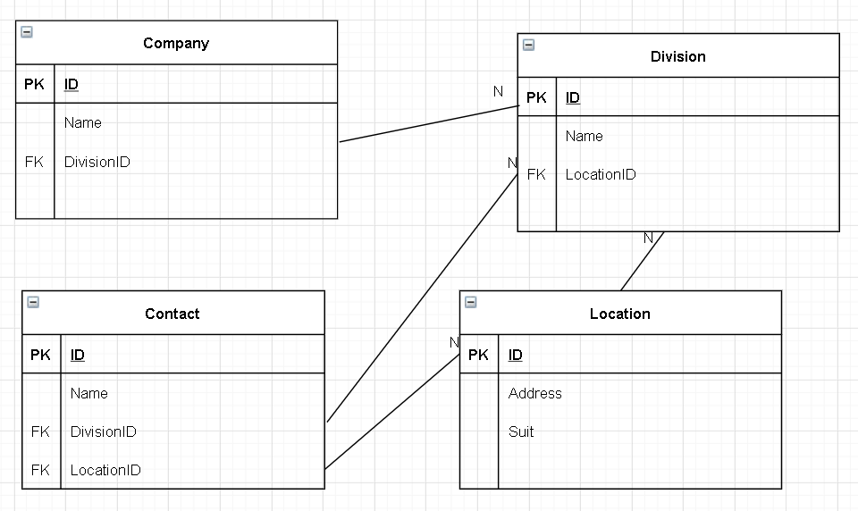

03/01/2021

Assignment Day 5–SQL

# Answer following questions

1.  **What is an object in SQL?**

    A *database object* is any defined object in a database that is used to store or reference data. Some examples of database objects include tables, schemas, views, clusters, indexes, and so on. 

2.  **What is Index? What are the advantages and disadvantages of using Indexes?**

    An index is an on-disk structure associated with a table or view that speeds retrieval of rows from the table or view. These keys are stored in a structure (B-tree) that enables SQL Server to find the row or rows associated with the key values quickly and efficiently.

    **Advantages**:

    - Fast search/sort data
    - Unique **indexes** guarantee uniquely identifiable records in the database.

    **Disadvantages:**

    - **Additional space**

      The Clustered index in SQL Server does not require any additional disk space. But each and every non clustered index requires additional disk space as it is stored separately from the table.

    - **Insert Update and delete statement become Slow**

      When any DML statement such as `Insert`, `Update` and `Delete` modifies data in a table, the database needs to update all of the indexes where data has changed.


3.  **What are the types of Indexes?**

    There are many index types available in SQL Server such as:

    - Clustered/ Nonclustered
    - Unique
    - Index on computed columns
    - Hash index
    - etc...


4.  **Does SQL Server automatically create indexes when a table is created? If yes, under which constraints?**

    Creating a primary key automatically creates a corresponding unique clustered index.


5.  **Can a table have multiple clustered index? Why?**

    No. One table can ONLY have one clustered indexes, because the data rows themselves can be stored in only one order.


6.  **Can an index be created on multiple columns? Is yes, is the order of columns matter?**

    Yes.  Indexes can be composites - composed of multiple columns - and the order is important because of the leftmost principle. Reason is, that the database checks the list from left to right, and has to find a corresponding column reference matching the order defined.


7.  **Can indexes be created on views?**

    Yes. Creating a unique clustered index on a view improves query performance because the view is stored in the database in the same way a table with a clustered index is stored.


8.  **What is normalization? What are the steps (normal forms) to achieve normalization?**

    Database *normalization* is the process of structuring a database. This includes creating tables and establishing relationships between those tables according to rules designed both to protect the data and to make the database more flexible by eliminating redundancy and inconsistent dependency.

    - 1NF

      - Atomic value per cell

    - 2NF

      - 1NF

      - Move redundant data to separate table and create relationships between these tables using foreign keys.

        When a table's `PK` contains only one column, the table automatically in 2nd normal form because there would be no way for a column to be dependent on only a portion of the primary key.

        Otherwise, if the `PK` composed with more than one column, then other columns should be fully depend on these columns.

        **Example:**

        ​	Example Table (teacher_id, subject, teacher_age)
    
    ​	**Candidate Keys**: {teacher_id, subject}
    ​    ​	**Non prime attribute**: teacher_age

        Need to change the table to:
    
        ​	Teacher (teacher_id, teacher_age)
    
        ​	Table_Subject (teacher_id, subject)

    - 3NF

      - 2NF

      - Does not contain columns that are not fully dependent on `PK`.

        **Example:**

        ​	Client (ClientNum, ClientName,Balance, CreditLimit,**ConsltNum, LastName, FirstName**)

        ​	Consultant (ConsultNum, LastName, FirstName)

        Need to change the table to:

        ​	Client (ClientNum, ClientName,Balance, CreditLimit,**ConsltNum**)

        ​	Consultant (ConsultNum, LastName, FirstName)

    - Boyce & Codd normal form (BCNF)

      - 3NF

      - N-to-N relationship using a joining table

        **Example:**

        ​	Faculty (FacultyNum, StudentNum, CommitteeCode)

        Need to change the table to:

        ​	FacStudent (FacultyNum, StudentNum)
    
        ​	FacCommittee (FacultyNum, CommitteeCode)


9.  **What is denormalization and under which scenarios can it be preferable?**

    Denormalization is a database optimization technique in which we add redundant data to one or more tables. This can help us avoid costly joins in a relational database.

    If the queries are running too slowly and it’s because of the complexity of the query, we can denormalize the database just enough to get rid of too many joins.


10.  **How do you achieve Data Integrity in SQL Server?**

     1. Using ==`Transaction`==
     2. Add **constraints** such as pk, fk, not null, etc to the column to ensure the accuracy of data.
     3. Maintain a regular backup of data


11.  **What are the different kinds of constraint do SQL Server have?**

     - not null
- unique
     - pk
- fk
     - check constraints
- etc


12.  **What is the difference between Primary Key and Unique Key?**

     | Primary Key                                                  | Unique Key                                                   |
     | ------------------------------------------------------------ | ------------------------------------------------------------ |
     | no null values                                               | can accept only one null value.                              |
     | By default, Primary key is clustered index and data in the database table is physically organized in the sequence of clustered index. | By default, Unique key is a unique non-clustered index.      |
     | 1 pk per table                                               | 1-N unique key per table                                     |
     | Primary key can be made foreign key into another table.      | In SQL Server, Unique key can be made foreign key into another table. |


13.  **What is foreign key?**

     - It is a key used to link two tables together. To reference to a primary key in another table.
     - In practice, A FOREIGN KEY constraint does not have to be linked only to a PRIMARY KEY constraint in another table; it can also be defined to reference the columns of a **UNIQUE** constraint in another table, or even **any Indexes**. In textbook, it has to be a PK of another table.


14.  **Can a table have multiple foreign keys?**

     Yes.


15.  **Does a foreign key have to be unique? Can it be null?**

     By default there are no constraints on the **foreign key**, **foreign key can** be **null** and **duplicate**.


16.  ==<review>==**Can we create indexes on Table Variables or Temporary Tables?**

     Can create indexes on Temporary Tables but not on Table Variables.
     
     https://www.erikdarlingdata.com/sql-server/when-should-you-index-temp-tables/
     
     
     
17.  **What is Transaction? What types of transaction levels are there in SQL Server?**

     Transaction is the execution of a sequence of 1 or more operations (e.g., SQL queries) on a database to perform some higher-level function.

     It will keep database in consistent state.

     **Types of transaction levels:**
     
     ```sql
     SET TRANSACTION ISOLATION LEVEL
         { READ UNCOMMITTED   -- Lowest level
         | READ COMMITTED
         | REPEATABLE READ
         | SERIALIZABLE      -- high consistency
         | SNAPSHOT
         }
     ```


# **Write queries for following scenari**os

1.  **Write an sql statement that will display the name of each customer and the sum of order totals placed by that customer during the year 2002**
     **Create table customer(cust_id int,  name varchar (50)) **

    **create table order(order_id int,cust_id int,amount money,order_date smalldatetime)**

    ```sql
    select name, sum(o.[amount money])
    from customer c
    join order o
    on c.cust_id = o.cust_id
    where Year(o.order_date) = 2002
    group by c.cust_id
    ```


 2.  **The following table is used to store information about company’s personnel:Create table person (id int, firstname varchar(100), lastname varchar(100)). write a query that returns all employees whose last names  start with “A”.**

        ```sql
        select *
        from person
        where firstname like 'A%'
        ```


3.  **The information about company’s personnel is stored in the following table:**

    **The filed managed_id contains the person_id of the employee’s manager.**
    **Please write a query that would return the names of all top managers(an employee who does not have  a manger, and the number of people that report directly to this manager.**

    ```sql
    Create table person(
        person_id int primary key,
        manager_id int null,
        name varchar(100)not null
    );

    select p1.person_id, count(select person_id from person p2
                              where p2.manager_id = p1.person_id
                              ) as PeopleReportCount
    from person p1
    where manager_id is null
    ```


4.  **List all events that can cause a trigger to be executed.**

    DML, DDL, or logon trigger.

    - DML statements that modify data in a table ( INSERT , UPDATE , or DELETE )

    - DDL statements ( CREATE, ALTER, and DROP statements, and certain system stored procedures that perform DDL-like operations.)

    - System events such as startup, shutdown, and error messages.

    - User events -  logon: when a user's session is being established.


5. **Generate a destination schema in 3rd Normal Form.  Include all necessary fact, join, and dictionary tables, and all Primary and Foreign Key relationships.  The following assumptions can be made:**
    **a. Each Company can have one or more Divisions.**
    **b. Each record in the Company table represents a unique combination**
    **c. Physical locations are associated with Divisions.**
    **d. Some Company Divisions are collocated at the same physical of Company Name and Division Name.**
    **e. Contacts can be associated with one or more divisions and the address, but are differentiated by suite/mail drop records.status of each association should be separately maintained and audited.**

    


GOOD  LUCK.