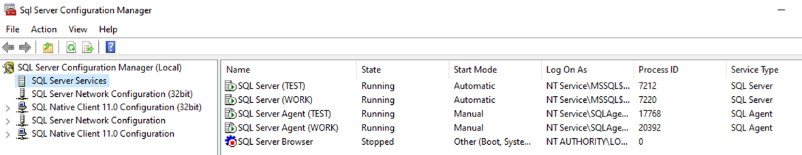
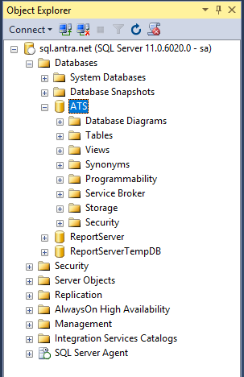
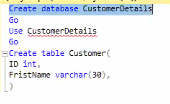
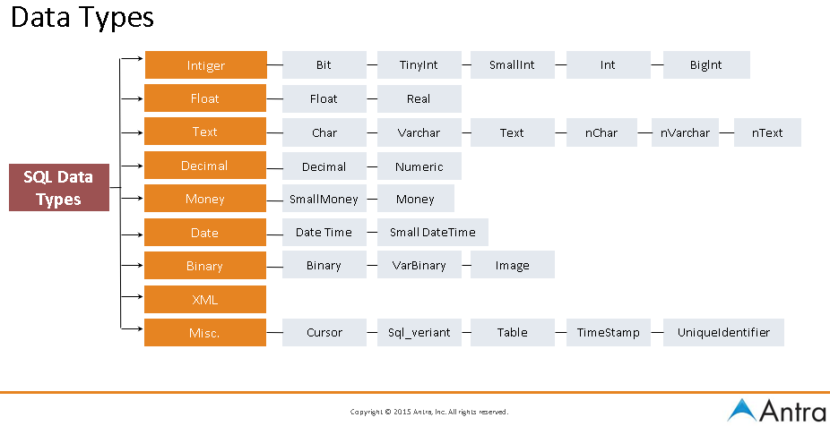
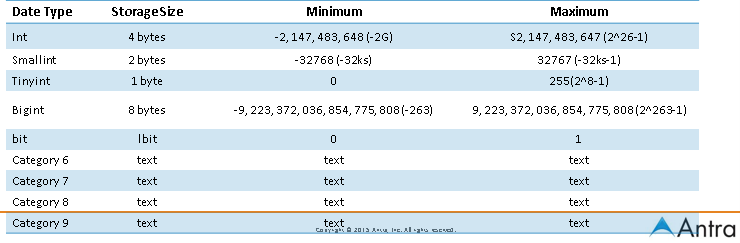
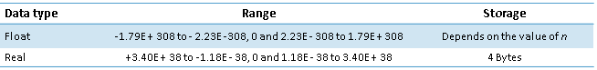
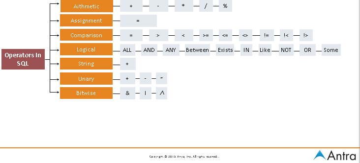

02/23/2021

# Intro to SQL Server

### SQL Server Tools

##### ❑ SQL Server Configuration Manager

- Manage SQL Server services and connection configurations by navigating objects in the Console tree

  

##### ❑ SQL Server Management Studio

- for accessing, configuring, managing, administering, and developing all components of SQL Server.
- key features:
  - Enterprise Manager,
  - Query Analyzer,
  - Analysis Manager
  - Reporting Services,
  - Integration Services,
  - SQL Server Compact Edition,
  - Notification Services.

##### ❑ SQL Server Profiler

❑ SQL Server Books Online (BOL)

❑ SQLCMD

### Microsoft SQL Server database

- collection of objects such as tables, views, stored procedures, and constraints.
- It maintains its own set of user accounts, roles, schemas and security
- size from 1 megabyte (MB) -1,048,516 terabytes .
- It can grow and shrink, either automatically or by command.
- **It can have objects joined in queries with objects from other databases in the same SQL Server instance or on linked servers.**

### SQL Server Instance

= DB Engine instance

- can have many instances per machine but only 1 default instance
- 1 instance manages several system databases and one or more user databases.
- 1 laptop can run N instances of the DB Engine
- To make the db work, we need to first connect the instance

### System Databases

❑ master

- **important!!** always keep a current backup of it
- the master database has system catalogs that keep information about disk space, file allocations and usage, systemwide configuration settings, endpoints, login accounts, databases on the current instance, and the existence of other SQL servers (for distributed operations).

❑ model

- template database
  - If you’d like every new database to start out with certain objects or permissions, you can put them in model, and all new databases will inherit them.

❑ tempdb

- used as a workspace
- it’s re-created–not recovered–every time SQL Server is restarted.
- •The tempdb database sizing and configuration is critical for optimal functioning and performance of SQL Server

❑ mssql system resource (hidden)

- resource db
- system stored procedures and functions are stored here.

❑ msdb

- used by the SQL Server Agent service to perform scheduled activities such as backups and replication tasks

- We usually don't need to access the tables in this database directly. We can think msdb tables as another form of system tables

### User Database

- created by users (Administrators, developers, and testers who have access to create databases).

### DB Files

attach -> add -> copy address to file explorer to find the location

- primary data files
  - **.mdf**
  - 1 database has one primary data file
  -  keeps track of all the rest of the files in the database, in addition to storing data.
- secondary data files
  - **.ndf**
  - 1 db can have 0 or more secondary data files
- Log files
  - **.ldf**
  - 1 database has 1+ log files that contains the information necessary to recover all transactions in a database.

### SQL vs T-SQL

|              | SQL                               | T-SQL                                                        |
| ------------ | --------------------------------- | ------------------------------------------------------------ |
| what         |                                   | Microsoft implementation of the SQL standard                 |
| where to use | RDBMS is uses for managing data.  | used by MS SQL server.                                       |
|              | interaction with database server. | no interaction with database server.                         |
| used for     | look over data using queries.     | creating application and add business logic.                 |
|              |                                   | a block of codes that used to write function and procedure.  |
|              |                                   | - Scalar function   - Ranking function  - Aggregate function  - Rowset function |

### Result Set

- Result set is a set of data, could be empty or not, returned by a select statement, or a stored procedure, that is saved in RAM or displayed on the screen.

- A TSQL script can have 0 to multiple result sets.

### Types Of Statements

|         | Full Name                    | Commands                            | What                                                   |
| ------- | ---------------------------- | ----------------------------------- | ------------------------------------------------------ |
| **DDL** | Data definition language     | create, drop, alter, truncate table | allow you to create objects in the database            |
| **DML** | Data manipulation language   | select, insert, update, delete data | allow you to query and modify the data                 |
| DCL     | Data control language        | Revoke and grant data               | allow you to determine who can see or modify the data. |
|         | Transaction control language | commit, rollback data               |                                                        |

### Batch Directives

- SQL Server processes single or multiple Transact-SQL statements in batches.

- A batch directive instructs SQL Server to parse and execute all of the instructions within the batch.

- There are two basic methods for handing off batches to SQL Server.

  1. GO :

     a signal to send the current batch of Transact-SQL statements to SQL Server.

     https://stackoverflow.com/questions/2299249/what-is-the-use-of-go-in-sql-server-management-studio-transact-sql

     - example

       consider as 1 batch

       use ``go`` to resolve the issue

       

  2. EXEC :

     The EXEC directive is used to execute a user-defined function, system procedure, user-defined stored procedure, or an extended stored procedure; it can also control the execution of a character string within a Transact-SQL batch. Parameters can be passed as arguments, and a return status can be assigned.

# Data Types

### Character Strings

- Char /nchar

   - store fixed size data.
   - maximum -> 8,000 characters, which is a significant increase over the 255-character limit in early versions.
   - When a variable or a table column is assigned with a string that is shorter than its nominal size, it is padded with trailing spaces to fill the specified field length

- Varchar / nvarchar

  - stores strings of variable size up to 8,000 characters long.
  - When a character value whose length is less than the nominal size is assigned to the column or variable, SQL Server does not add trailing spaces to it, but records it as is.
  - varchar data types occupy two additional bytes in order to record the length of the string

  

- varchar(max)

   Varchar (max) looks and operates like the varchar data type, but it is by internal structure and functionality actually much more like the text data type.

- Text

   - store huge amounts of data.
   - One field can store up to 2GB (231 - 1 bytes) of information.
   - Only a 16-byte pointer to this data is stored in the table. Therefore, additional processing overhead is involved with the use of text columns. There are special functions for processing text values. You cannot use union on Text.

##### Unicode Character Strings

- nchar

- nvarchar

- nvarchar(max)

- Ntext

Similar to character strings but accepts Unicode characters

### Date Time

- Date time (8 bytes)
  - The precision of date time is 3.33 ms, and it covers dates from January 1, 1753, to December 31, 9999.

- Small date time (4 bytes)
  - The precision of small date time is one minute, and it covers dates from January 1, 1900, through June 6, 2079, which is usually more than enough.

- Date

- Datetime2

### Numbers

##### Integer Numbers

- Bit is usually used for bool in mssql

##### Approximate Numbers

##### Decimals

### Monetary Data Types

- money and small money data types are a compromise between the precision of decimal numbers and the small size of real numbers

- ##### small money

  - small money occupies 4 bytes and uses the same internal structure as int numbers.
  - can store numbers ranging from −214,768.3648 to 214,768.3647 in the small money data type.

- ##### money data type

  - The money data type uses the same structure for storing information as the bigint data type. It occupies 8 bytes for storage, so its values must range from −922,337,203,685,477.5808 to +922,337,203,685,477.5807.

### Binary Data Types

- Binary
- Varbinary
- Image - similar to varbinary(MAX)
- Remarks

### Special Types

##### xml

The xml data type is a major new feature of SQL Server. Before it was introduced, users were storing XML documents as strings or binary data. The new data type allows SQL Server to parse an XML document stored in an XML column and verify that it is compliant with the schema that the user associated with the column

##### Unique identifier

 The unique identifier data type stores 16-byte binary values. These values are often called *globally unique identifiers (GUIDs).* When a system generates a new GUID value, it is guaranteed that the same value cannot be produced again, neither on the same computer nor on any other computer in the world

 Character string ‘{BB7DF450-F119-11CD-8465-OOAA00425D90}’

 Binary constant Oxaf16a66f7f8b31d3b41d30c04fc96f46

##### timestamp

 The timestamp data type is not designed to store date or time information, but rather is a binary value that serves as a version number of the record. The value is updated every time the record is updated, and the value is unique in the database. **It is used to implement optimistic locking**.

### Variables & Identifiers

- local variables
  - @xx
- global variables

- temp identifiers
  - \#  temporary table or procedure.
  - \##  global temporary object.

# Flow-control Statements

❑ Statement block

❑ If… Else

❑ While…Break

❑ Break

❑ Continue GoTo

❑ WaitFor

# Operators

| wildcard | usage                                           |
| -------- | ----------------------------------------------- |
| %        | a string of 0 or more characters                |
| -        | single character                                |
| []       | single character, from a selected range of list |
| [^]      | single character not within the specified range |
