02/24/2021

## Types of joins

### outer join

- ##### left outer join = left join

  - = matching rows + non matching rows from the left table

- ##### right outer join  = right join

  - = matching rows + non matching rows from the right table

- ##### full outer join

  - get all the data from left and right tables

### inner join = join

### self join

- join the table itself
- example: employee's salary is higher than the manager

### cross join

- Cartesian product from 2 tables


## Commands

### TRUNCATE, DELETE, DROP

| DELETE                                                       | TRUNCATE                                                     | DROP                                                         |
| ------------------------------------------------------------ | ------------------------------------------------------------ | ------------------------------------------------------------ |
| DML (Data Manipulation Language)                             | DDL (Data Definition Language)                               | DDL                                                          |
| delete all or specific rows from a table specified using a **Where** clause<br>When the DELETE statement is executed without WHERE clause it will delete all the rows | removes all rows in a table by deallocating the pages that are used to store the table data. **No Where** clause in this. | Remove a table from the database. All the tables' rows, indexes, and privileges will also be removed. |
| a tuple is locked before removing it.                        | data page is locked before removing the table data.          |                                                              |
| logs entry for each deleted row in the transaction log.      | does not log entries for each deleted row in the transaction log. |                                                              |
| slower                                                       | faster                                                       |                                                              |
| can activate a trigger.                                      | cannot activate a trigger.                                   | No DML triggers will be fired.                               |
| can be rolled back (undone)                                  | **cannot rolled back**.                                      | **cannot rolled back**.                                      |


### COUNT

##### What’s the difference between `COUNT(1)`, `COUNT(*)`, and `COUNT(column_name)`?

`COUNT(*)` =`COUNT(1)`, will **always** return the same result. 

- **COUNT**(**1**) 
  -  it's the same as **COUNT**(0) or **COUNT**(42) .
  -  it will count all the rows
- `COUNT(*)`
- `COUNT(column_name)`
  - count not-null rows in the column


### TOP

```sql
select TOP 5 Name, Gender, Salary 
from tb1Employee
order by Salary DESC
```

##### Top + Percentage

```sql
--use AdventureWorks2019

declare @Percentage int
set @Percentage=1

select Top(@Percentage) percent Name
from Production.Product
Order by Name
```


## Aggregation Functions

when use aggregate functions, need to use group by.

##### Code structure:

- `select from where group by  `
  - insert,update delete
  - can't perform aggregate function but we can use in subquery

- `select from group by having`
  - select
  - perform aggregate function

##### Functions: 

- MAX()
- MIN()
- AVG()
- SUM()
  - 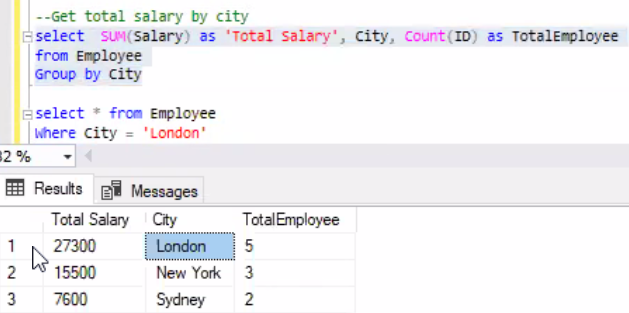


we have to manually write all the columns mentioned in the select statement to the group by clause . To resolve this, we can use a derived table. 


### INTO

- create a new table

  ```sql
  select e.Name, e.Gender,e.Salary 
  into EmployeeDetails 
  from Employee e
  ```

  

## Sub Queries

##### Definition

- A subquery can be nested inside the `WHERE` or `HAVING` clause of an outer `SELECT`, `INSERT`, `UPDATE`, or `DELETE` statement, or inside another subquery. 
- Up to 32 levels of nesting is possible

##### Syntax

`WHERE expression [NOT] IN (subquery)`

##### Rules

- subqueries cannot manipulate their results internally, therefore `ORDER BY` clause cannot be added into a subquery. Need to write ORDER BY in the main SELECT statement(outer query) which will be the last clause.

##### Types of Subqueries

- Single Row **Sub Query**
- Multiple row **sub query**
- Correlated **Sub Query**

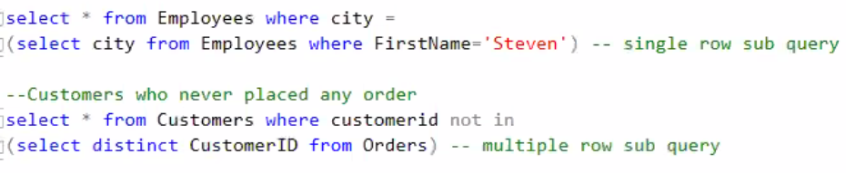

##### Examples

1. Find the employees from the same city where steven is living

   We can split the question into two parts:

- find the city where steven is living

- find other employees from the same city

  ```sql
  select * from Employees 
  where city = (select city from Employees
               where FirstName='Steven')
  ```

​		outer query is depend on inner query.


### Correlated subquery

- inner query is depend on outer query

- inner query uses the value from the outer query

- Because the subquery may be evaluated once for each row processed by the outer query, it can be slow.

  ```sql
   SELECT employee_number, name
     FROM employees emp
     WHERE salary > (
       SELECT AVG(salary)
         FROM employees
         WHERE department = emp.department);
  ```


In the above nested query the inner query has to be re-executed for each employee. (A sufficiently smart implementation may cache the inner query's result on a department-by-department basis, but even in the best case the inner query must be executed once per department.)


### UNION and UNION ALL 

UNION and UNION ALL are set operators, they combine the result set together, vertically.

- `union all` is faster than `union`
  - With `union`, since the database server must do additional work to remove the duplicate rows, but usually you do not want the duplicates (especially when developing reports).
- union does not  support recursive CET where as Union all supports recursive CTE
- two tables need to have the same # of columns and data type


## Window Function

##### Rank() - {1,2,2,4}

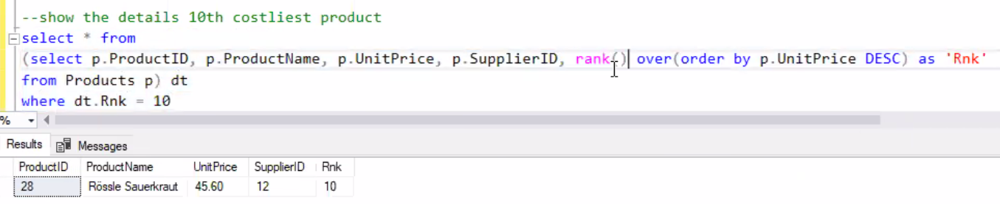

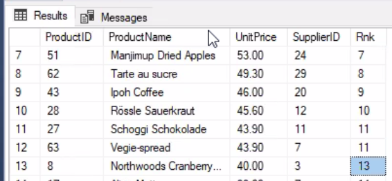

##### Dense_rank() - {1,2,2,3}

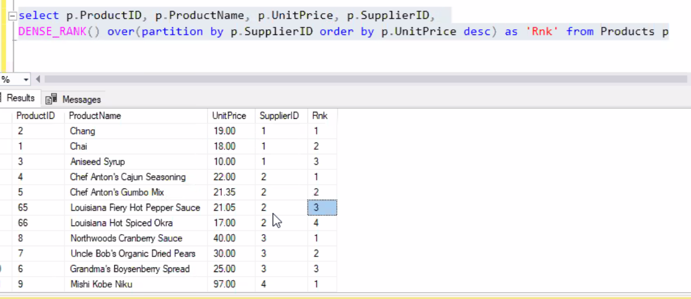

find top 3 products, order by customer from every city

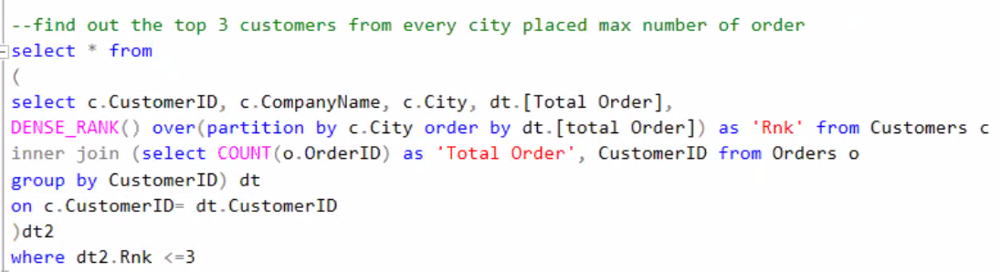


##### ROW_NUMBER()


## CTE 

### What is CTE (common table expression)?

- Can create a **recursive query.**
- **Temp view.** **No** need to store the definition in **metadata**.
- **Better readability and ease in maintenance of complex queries.** The query can be divided into separate, simple, logical building blocks. These simple blocks can then be used to build more complex, interim CTEs until the final result set is generated. 
- CTEs can be defined in user-defined routines, such as functions, stored procedures, triggers, or views.

syntax

```sql
with cte
as
(select...)
```

### Examples

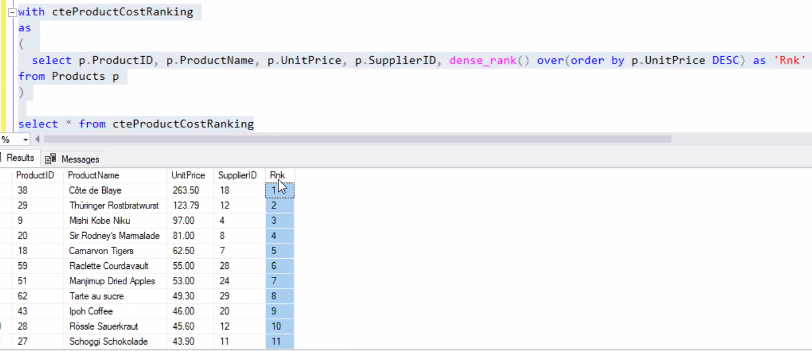


```sql
with cteCustomerOrderCount
as(
	select count(o.OrderID) as 'Total Order',         o.CustomerID 
	from Orders o 
	group by o.CustomerID
), cteTopCustomerbyCity 
as(
	select c.CustomerID, c.CompanyName, c.City, dt.[Total Order],
	DENSE_RANK() over(partition by c.City order by dt.[Total Order]) as 'Rnk' 
	from Customers c
	inner join cteCustomerOrderCount dt
	on c.CustomerID = dt.CustomerID
)
select * from cteCustomerOrderCount
```

CTE with Rank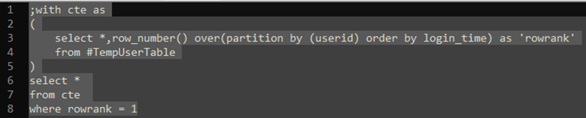

### recursive CTE

Example Employee:

table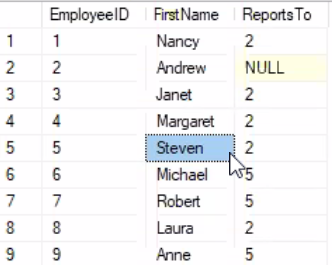


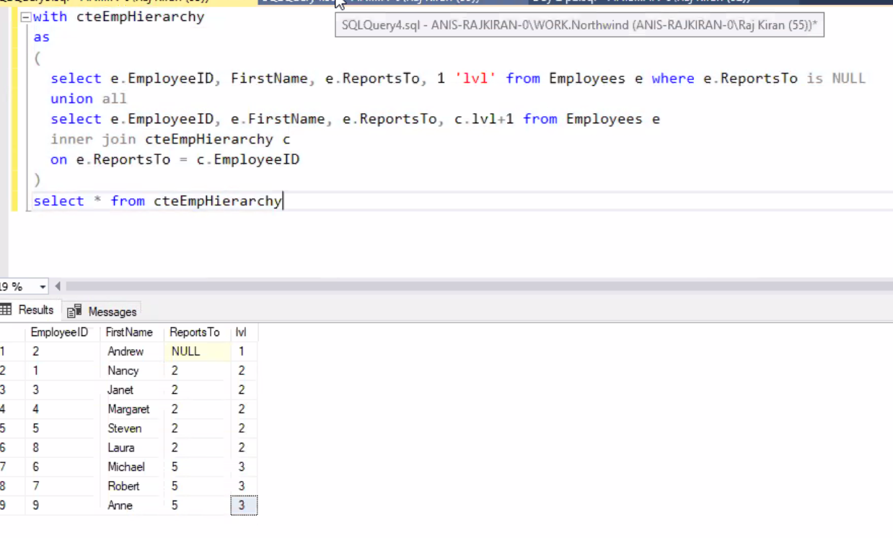

lvl = level


## Temp Tables

- Just like regular tables, only they are automatically stored in the `tempdb `database.
- When have large query,  use temp table. Use table variable for small result set 

### Temp table types: 

- ##### Local 

  - \#TableName

  - Scope: current session. if we create a local temp table in one session, we cannot access it in other sessions. if close the window, the table will get deleted automatically.

    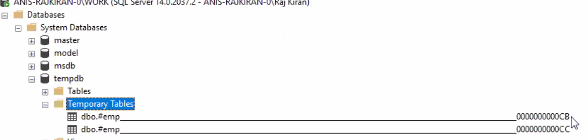

    ```sql
    create table #emp(ID int identity(1,1),FirstName varchar(20))
    insert into #emp values('James')
    ```

    

- ##### Global

  - \##TableName
  - Scope: visible to all sessions(connections)
  - 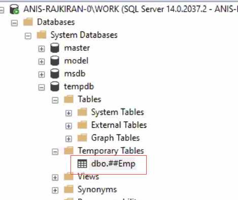


### Table Variable

- A *table variable* is a data type that can be used within a Transact-SQL batch, stored procedure, or function—and is created and defined similarly to a table, only with a strictly defined lifetime scope. 

- Unlike regular tables or temporary tables, table variables CANNOT have indexes or FOREIGN KEY constraints added to them. Table variables do allow some constraints to be used in the table definition (PRIMARY KEY, UNIQUE, CHECK).

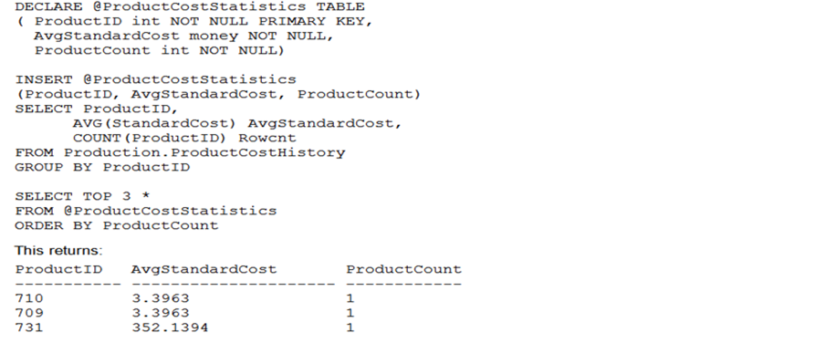


### Derived Table

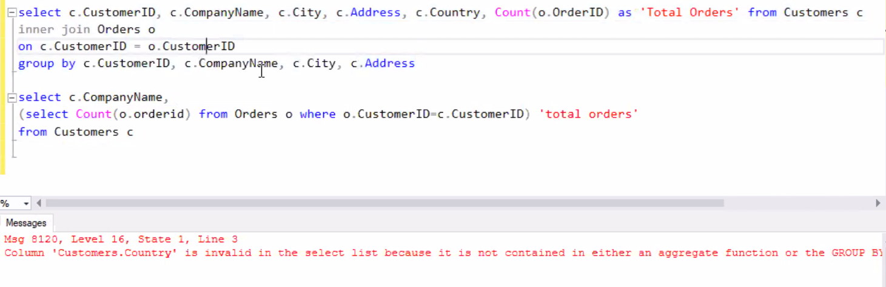

instead of group by multiple column names, resolve using derived table

101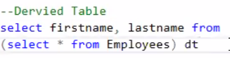

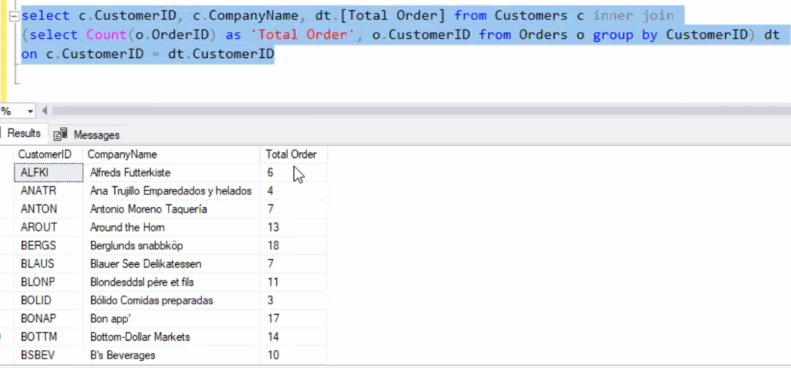


### Exception Handling 

```sql
BEGIN TRY
    -- Generate divide-by-zero error.
    SELECT 1/0;
END TRY
BEGIN CATCH
SELECT ERROR_NUMBER() AS ErrorNumber, ERROR_LINE() AS LineNumber, 	ERROR_SEVERITY() AS ErrorSeverity,
ERROR_MESSAGE() AS ErrorMessage;
END CATCH

```

