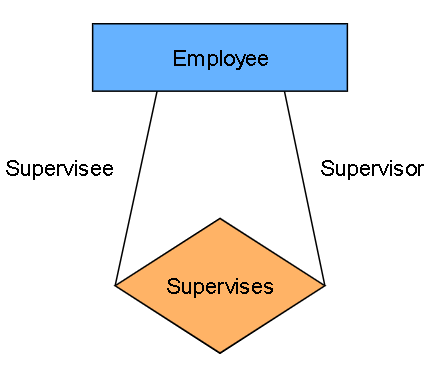
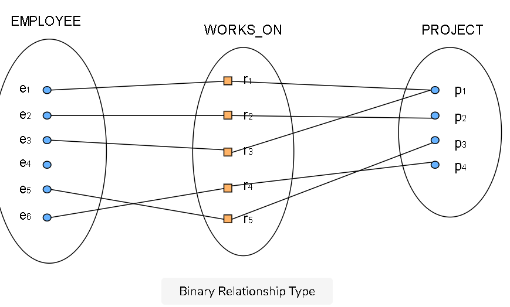
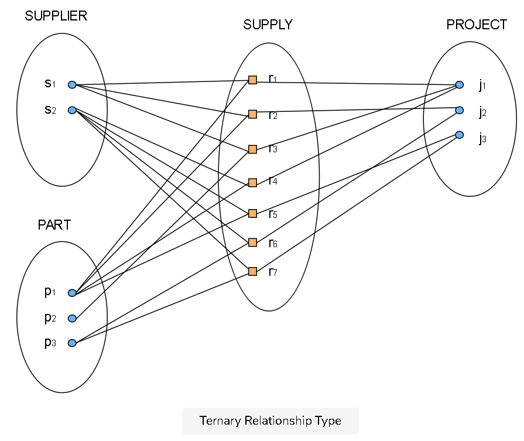
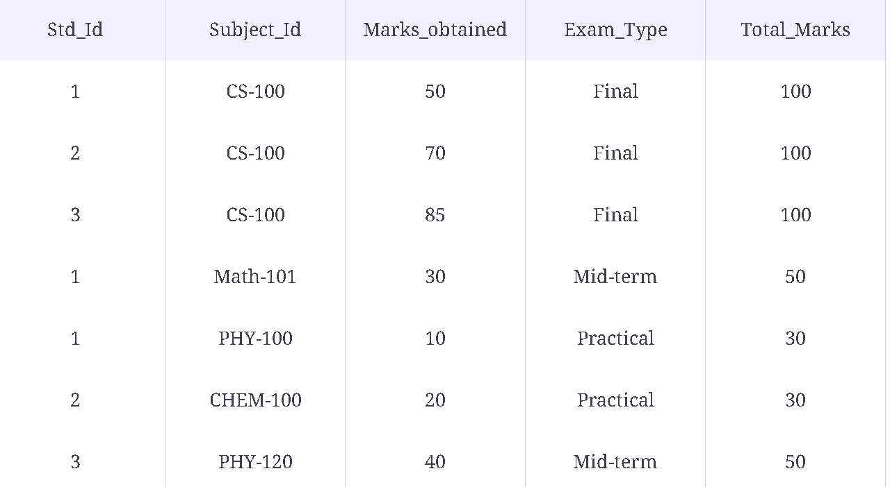
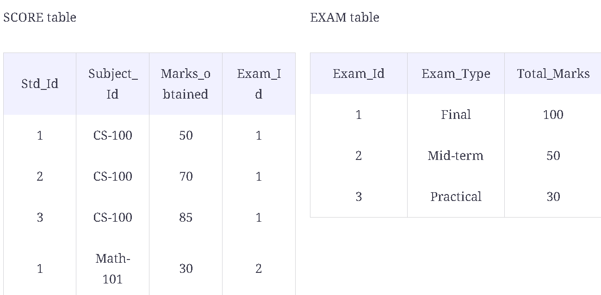
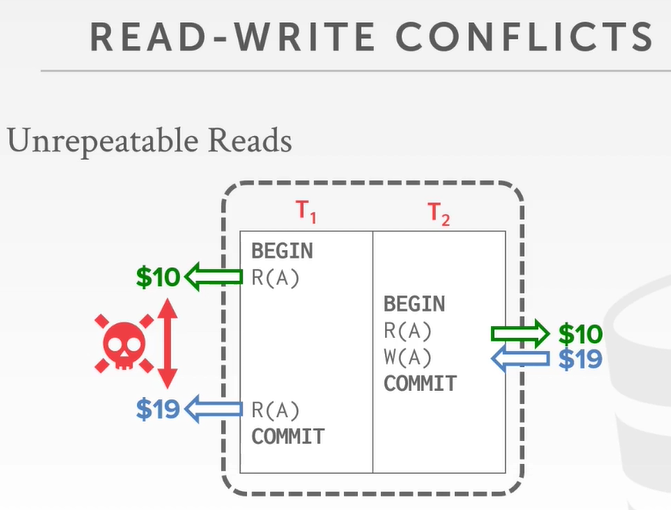
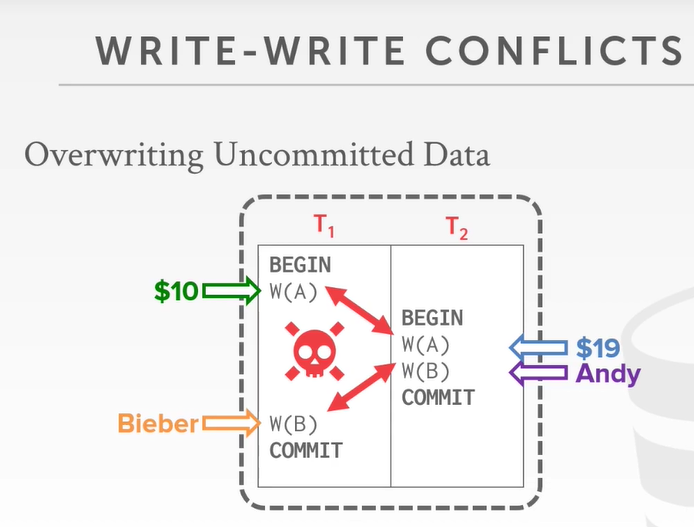
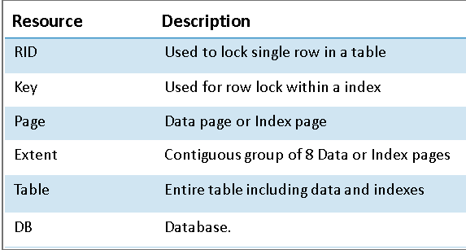
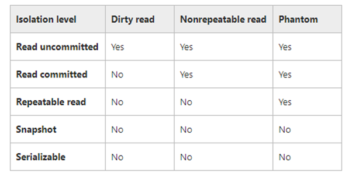
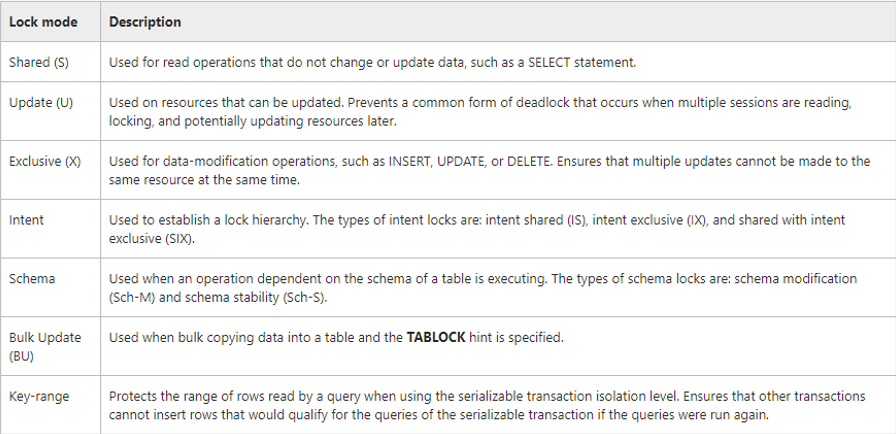

02/26/2021

## Fundamental Concepts

### Data Models

> A data model is a collection of concepts or notations for describing data, data relationships, data semantics, and data constraints.

#### 1. High-level conceptual data models

Entity relationship model. 

##### Entities

An entity might be:

- An object with physical existence (e.g., a lecturer, a student, a car).
- An object with conceptual existence (e.g., a course, a job, a position).

##### Attributes

properties of that entity

e.g. an employee named Steve, who is 23 years old, lives in Ohio, and earns $50,000, etc.

**Types of attributes**

- atomic value
- composite attributes
  -  the `Address` attribute may consist of `House_No`, `Street` and `Suburb`
- multivalued attributes
  - one employee may not have any college degrees, another may have one, and a third person may have two or more degrees.  Therefore, different people can have a different amount of values for the `Degrees` attribute.

- derived attribute
  - that `Age` can be derived from the attribute `Bdate`

##### Relationships

the relationship between different entities

**Degrees of relationship types**

A project can have N employees to work on.

A employee can work on multiple projects.

We represent this situation in our ER model through the degrees of a relationship.

1. The **Unary (recursive) relationship** type

   

    For example, The SUPERVISES relationship type relates an employee to a supervisor, where both employee and supervisor entities are members of the same EMPLOYEE entity set. Hence, the EMPLOYEE entity type participates twice in SUPERVISION.

2. The **Binary relationship** type

   Employee  WORKS_ON  Project

   the employees e_1 and e_3 work on project p_1, the employee e_2 works on project p_2, and so on.

3. The **Ternary relationship** type

   

SUPPLY. instance r_i*i* associates three entities—a supplier s, supplies part p, to a project j.

#### 2. Record-based logical data models

- hierarchical (tree)
- network (graph)
  - expands upon the hierarchical structure
  - each record can have multiple parent and child records
- relational data models (table)
  - DB contains multiple tables (relations) which in turn have several attributes (columns) and tuples (rows).

#### 3. Physical data models

Represents each table, its columns, and specifications, etc. It also highlights how tables are built and related to each other in the database. 


### The three-schema architecture

### 1. External schema

- the part of the database that a specific user is interested in.
- It hides the unrelated details of the database from the user
- For example, a user from the sales department will only see sales-related data.

### 2. Conceptual schema

- This schema hides information about the physical storage structures and focuses on describing data types, entities, relationships, etc.

### 3. Internal schema

- how the database is stored on physical storage devices such as hard drives. The internal schema uses a physical data model and describes the complete details of data storage and access paths for the database.

##### Think in this way:

- **example schema** = web browser on your computer

- **conceptual schema** = server that hosting the website. It receive your request, retrieves the data you want from the database, then sends the data back to your computer.

- **internal schema** = the database that stored on some physical media

##### Why use the three-schema architecture? 

Here are some of the goals that can be achieved using the three schema architecture:

- Every user should be able to access the same data, but be able to see a customized view of the data.
- The user does not need to deal directly with physical database storage details.
- The database administrator should be able to change the database storage structure without disturbing the user’s view.
- The internal structure of the database should remain unaffected when changes are made to the physical aspects of storage.


### Classification of Database Management Systems

#### Based on data model

- Well-known DBMSs: Oracle, MS SQL Server, DB2 and MySQL
- object-oriented DBMSs: O2, ObjectStore, and Jasmine.

#### Based on number of users

-  single-user database system
- **multi-user database system**, which supports multiple users concurrently.

#### Based on database distribution

1. ##### Centralized system

   The database is stored in the central computer. The different users can access the database using their terminals.

2. ##### Distributed database system

3. ##### Homogeneous distributed database system

   use the same DBMS software from multiple sites.

   For example, library information systems by the same vendor.

4. ##### Heterogeneous distributed database system

   different sites might use different DBMS software, but there is additional common software to support data exchange between these sites


## Relational Data Model

### Constraints

##### Not Null

##### Unique 

- No duplicate record, e.g., `ssn`(Social Security number)
- Multiple UNIQUE constraints can be defined on a table 
- Accept one null value
- Index will be unsorted

##### PK

= (unique key + not null)  && default clustered index, sorted)

**Difference between Primary Key and Unique Key**

| Primary Key                                                  | Unique Key                                                   |
| ------------------------------------------------------------ | ------------------------------------------------------------ |
| no null values                                               | can accept only one null value.                              |
| By default, Primary key is clustered index and data in the database table is physically organized in the sequence of clustered index. | By default, Unique key is a unique non-clustered index.      |
| 1 pk per table                                               | 1-N unique key per table                                     |
| Primary key can be made foreign key into another table.      | In SQL Server, Unique key can be made foreign key into another table. |

##### Candidate Key 

- a set of one or more fields/columns that can identify a record uniquely in a table. 
- There can be multiple Candidate Keys in one table. Each Candidate Key can work as Primary Key.

##### Composite Key

Sometimes a single attribute is not enough to uniquely identify each entity within an entity set.

- Composite Key is a combination of more than one fields/columns of a table.
- Examples:
  -  `VIN` (vehicle identification number)  = State` +`Number

##### Check Constraints

```sql
age int check(age>20 and age<50)
```

##### FK

> "All valid values for this column come from 'that_column' in 'that_table'."
>
> When delete a row in the `ChildTable` , ok.
>
> When delete a row in the `ParentTable` --you remove a valid value from the possible values for the "child" table.  Which means that  when a `Parent` row is deleted (killed), no orphan row should stay alive in the `Child` table.  Use `on delete cascade` to solve this issue.

###### on delete cascade

ParentTable

ChildTable (fk on delete cascade)

```sql
DeptID int foreign key references Dept(ID) on delete cascade -- or on delete set null

```


## Normalization

### 1st Normal Form

- atomic value. no multiple values separate by comma in one cell


### 2nd normal form

- 1NF

- no partial dependencies. If the column is dependent on one or few columns only, then it is partial dependency.

- if the column alone cant be used to identify each tuple uniquely, then move that column to a separate table. 

  REPLACE  -> 

to -> 

### 3rd normal form

- 1NF,2NF
- no [transitive dependency](https://www.educative.io/collection/page/10370001/5119687241236480/6187879053131776).
  - a non-prime attribute depends on other non-prime attributes rather than depending upon the prime attributes( pk).

change 

to 

### 4NF

[Boyce–Codd normal form](https://en.wikipedia.org/wiki/Boyce–Codd_normal_form) (BCNF)

N-N relationship using a joint table


## Transaction 

### Definition

Transaction is the execution of a sequence of 1 or more operations (e.g., SQL queries) on a database to perform some higher-level function.

- It is a single recoverable unit of work that executes either:
  - Atomic (all or nothing)
    - Completely
    - Not at all

- A logical unit of work is a SQL operation or a set of SQL statements executed against a database

  - Usually include at least one statement

  - Changes the database from one consistent state to another

    e.g., transfer the money from my account to your account

### Transaction Example

Move $100 from Andy's bank account to his promotor's account.

Transaction:

- Check whether Andy has $100
- Deduct $100 from Andy's account
- Add $100 to his promotor account.

The above will all happen, or none of them will happen.

### Outcomes

- success – "committed" or "saved"

  After a transaction is committed, it can not be undone

  ```sql
  BEGIN transaction
  /* sql_statements*/
  COMMIT 
  ```

- fail - "rolled back" or "undone“

  ```sql
  BEGIN transaction
  /* sql_statements*/
  ROLLBACK  
  ```

### Rules - ACID Properties

##### Atomicity  - "all or nothing"

- **Prob Scenario1**

  - We take $100 out of Andy's account but then the DBMS aborts the txn before we transfer it.

- Prob  Scenario2

  - We take $100 out of Andy's account but then there is a power failure before we transfer it.

- ###### Approach 1: Logging 

  - like the black box in airplanes
  - DBMS logs all actions so that it can undo the actions of aborted transactions.
  - Maintain undo records both in memory and on disk. 

  Logging is used by almost every DBMS

  - Audit Trail
  - Efficiency Reasons

- ###### Approach 2: Shadow Paging (few uses this, not recommend)

  - DBMS makes copies of pages and txns make changes to those copies. Only when the txn commits is the page made visable to others.
  - Originally from System R
  - Few systems do this: CouchDB, LMBD(OpenLDAP)

##### Consistency - "it looks correct to me"

- committing changes made or rolling back data modification

##### Isolation - "as if alone"

- Modification done by concurrent transaction must be isolated 

   ==Locking== facility preserves Transaction Isolation

##### Durability - "survive failures"

- The effects of the transaction stored in the system permanently for further use.

  ==Logging== facility ensures transaction durability

### Transactions Concurrency Control

A **concurrency control** protocol is how the DBMS decides the proper interleaving of operations from multiple transactions.

- ##### Pessimistic concurrency control

  Don't let problems arise in the first place.

  - After a transaction performs an action that causes a lock to be applied, other users cannot perform actions that would conflict with the lock until the owner releases it. 
  - Use where the `cost of rolling back transactions` >`cost of protecting data with locks `  if concurrency conflicts occur.

- ##### Optimistic concurrency control

  Assume conflicts are rare, deal with them after they happen.

  - When a transaction updates data, the system checks to see if another user changed the data after it was read. If another user updated the data, an error is raised. Typically, the user receiving the error rolls back the transaction and starts over. 
  - Use where the `cost of occasionally rolling back ` < `cost of locking data` when read.

### Transactions  Concurrency Problems

- ##### Lost Updates

- ##### Dirty read (Uncommitted dependency)

- ##### Non-repeatable read (Inconsistent analysis)

  Non-repeatable reads are when your transaction reads committed **`UPDATES`** from another transaction. The same row now has **different values** than it did when your transaction began.

  

- ##### Phantom 幻影 reads

  Phantom reads are similar but when reading from committed **`INSERTS`** and/or **`DELETES`** from another transaction. There are **new rows** or **rows** that have **disappeared** since you began the transaction.

  

### Resources that can be locked



### [Transaction Isolation Levels](https://docs.microsoft.com/en-us/sql/t-sql/statements/set-transaction-isolation-level-transact-sql)
```sql
-- Syntax for SQL Server and Azure SQL Database
  
SET TRANSACTION ISOLATION LEVEL
    { READ UNCOMMITTED   -- Lowest level
    | READ COMMITTED
    | REPEATABLE READ
    | SERIALIZABLE      -- high consistency
    | SNAPSHOT
    }
```

Isolation levels are corresponding to different levels of locks: Shared, Update, Exclusive, Intent, Shema, Bulk Update and Key-Range.



##### 1. Read Uncommitted

​	Can read modified data, not yet committed. 

- At this level, Transactions **do not issue shared locks** to prevent other transactions from modifying data read by the current transaction. 
-  Dirty reads - values in the data can be changed and rows **can appear or disappear** in the data set before the end of the transaction. This option has the same effect as setting NOLOCK on all tables in all SELECT statements in a transaction. 

##### 2. Read Committed

​	Can read modified committed data. 

- Data can be changed by other transactions between individual statements within the current transaction, resulting in nonrepeatable reads or phantom data. 

##### 3. Repeatable read: 

​	Use repeatable read to resolve the lost update. 

​	In a **Serializable** isolation level all the rows are locked for the duration of the transaction, no insert,update or delete is allowed. 

##### 4. Serializable

- Statements cannot read data that has been modified but not yet committed by other transactions.

- No other transactions can modify data that has been read by the current transaction until the current transaction completes.

- Other transactions cannot insert new rows with key values that would fall in the range of keys read by any statements in the current transaction until the current transaction completes.

##### 5. Snapshot

- **Enhanced concurrency**

  In earlier versions of SQL Server, concurrency was based solely on locking, which caused blocking and deadlocking problems for some applications. Snapshot isolation, by contrast, depends on enhancements to row versioning and is intended to improve performance by avoiding reader-writer blocking scenarios.

- **Updated row versions for each transaction are maintained in** **tempdb**

  A unique transaction sequence number identifies each transaction, and these unique numbers are recorded for each row version. The transaction works with the most recent row versions having a sequence number before the sequence number of the transaction. Newer row versions created after the transaction has begun are ignored by the transaction.  

- **Snapshot isolation uses an optimistic concurrency model**

  If a snapshot transaction attempts to commit modifications to data that has changed since the transaction began, the transaction will roll back and an error will be raised. 

### Locks




### DeadLock

- The SQL Server Database Engine **automatically detects** deadlock cycles within SQL Server. The Database Engine **chooses one** of the sessions as a **deadlock victim** and the current transaction is **terminated with an error** to break the deadlock.

- To minimize the possibility of a deadlock
  - Have all transaction access the tables in the **same order**
  - Use hold lock only when repeatable reads are necessary
  - Avoid long running transactions, make transactions small and commit as soon as possible
  - Avoid user input while you have a hold lock on a table
  - Avoid numerous simultaneous executions of DML commands like insert, update, delete


