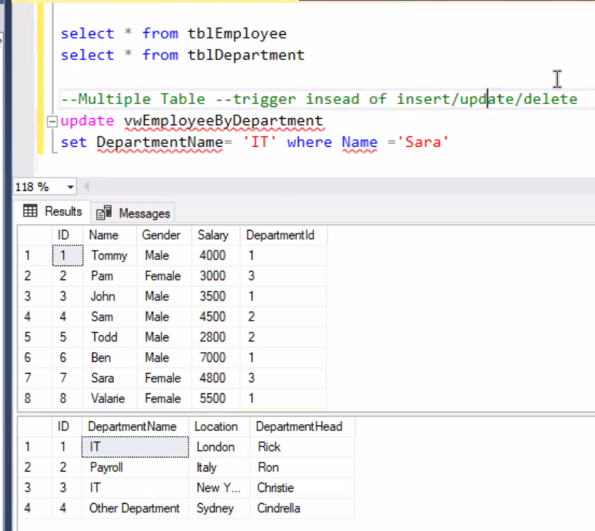

03/01/2021

# Advanced SQL

## View 

### Why View?

- simple virtual table. ==only select==
- view is for user. less involved than the full database.
- Unless indexed, a view does not exist as a stored set of data values in a database.

### Types of Views

| **View** **Type**             | **Description**                                              |
| ----------------------------- | ------------------------------------------------------------ |
| Regular  View                 | Defined  by a Transact-SQL query. No data is actually  stored  in the databases, only the view definition. |
| Indexed  View                 | First  defined by a Transact-SQL query, and then, after certain requirements are  met, a clustered index is created on it materialize the index data similar  to  table data. Once a clustered index is created, multiple nonclustered  indexes can be created on the indexed view as needed. |
| Distributed  Partitioned View | This  is a view that UNION ALL to combine multiple, smaller tables separated across  two or more SQL Server instances into a single, Virtual table for performance  purposes and scalability (expansion of table size on each SQL Server  instance, for example). |

### Syntax and Examples

##### Create View

```
create view viewName
[WITH ENCRYPTION]
as 
select ...
```

```sql
-- create view
use Company
Go

create view vwEmployeeByDepartment
as
select e.ID, e.Name, e.Gender, e.Salary, d.DepartmentName from tblEmployee e
inner join tblDepartment d
on e.DepartmentID = d.ID
GO

select * from vwEmployeeByDepartment
```

[ Create Indexed Views](https://docs.microsoft.com/en-us/sql/relational-databases/views/create-indexed-views?view=sql-server-ver15)

##### Modify View

**Restrictions:**

- Any modifications, including UPDATE, INSERT, and DELETE statements, must reference columns from only one base table.
- The columns being modified in the view must directly reference the underlying data in the table columns. The columns cannot be derived in any other way ( AVG, COUNT, SUM, MIN, MAX)
- The columns being modified are not affected by GROUP BY, HAVING, or DISTINCT clauses.

Option:

INSTEAD OF triggers can be created on a view to make a view updatable. [DML Triggers](https://docs.microsoft.com/en-us/sql/relational-databases/triggers/dml-triggers?view=sql-server-ver15)

```sql
alter view vwName
as 
select ...
```

```sql
alter view vwEmployeeByDepartment
as
select e.ID, e.Name, e.Gender, e.Salary, d.DepartmentName from tblEmployee e
inner join tblDepartment d
on e.DepartmentID = d.ID

Go

select * from vwEmployeeByDepartment
```


to insert/update/ delete data on multiple table in a view -> will get inconsistent data 



```sql
-- sp_helptext 
-- can be passed any SQL Server object that contains code, for example stored procedures, views, functions, triggers etc. It then returns the code for that object.
sp_helptext vwOrderDetails

-- sp_depends
--  returns information about dependencies between objects within the current database.
-- For example, the views and procedures that depend on a table or view
sp_depends
```


### Pros and Cons about View

##### Pro

1. **Simply data manipulation** 

   We can define frequently used joins, projections, UNION queries, and SELECT queries as views so that users do not have to specify all the conditions and qualifications every time an additional operation is performed on that data. 

2. **Customize data**

   Views let different users to see data in different ways, even when they are using the same data at the same time. 

##### Con

##### Why to use triggers on views?

when we update table, and we have a View that joining multiple tables,

if we update, the view will be wrong.

 so resolve this, we need to use trigger  for updating operation (See later Trigger section)


## Stored Procedures

### Definition

- A stored procedure groups one or more Transact-SQL statements into a logical unit, stored as an object in a SQL Server database 
- Unlike user-defined functions or views, when a stored procedure is executed for the first time (since the SQL Server instance was last started), **SQL determines the most optimal query** access plan and stores it in the **plan memory cache**. SQL Server can then reuse the plan on subsequent executions of this stored procedure 
- Plan reuse allows stored procedures to provide fast and reliable performance compared to non-compiled ad hoc query equivalents 

### Syntax and Examples

##### Simple CREATE  Stored Procedure

```sql
-- syntax
CREATE PROCEDURE spProcedureName     -- use usp or sp as prefix
AS
BEGIN
	SELECT
	...
END;	
GO; 

EXEC spProcedureName;     -- EXEC = EXECUTE
```

```sql
-- example
CREATE PROC uspProductList   -- PROC = PROCEDURE
AS
BEGIN
    SELECT 
        product_name, 
        list_price
    FROM 
        production.products
    ORDER BY 
        product_name;
END;
```

##### Simple Modify Stored Procedure

```sql
ALTER PROCEDURE uspProductList
    AS
    BEGIN
        SELECT 
            product_name, 
            list_price
        FROM 
            production.products
        ORDER BY 
            list_price 
END;
GO;
EXEC uspProductList;
```

### Stored Procedure With Parameter(s)

```sql
--Employee by Gender and department

CREATE proc spGetEmployeeGenderwithDepartment(@Gender varchar(30),@DeptID int)
AS
BEGIN
 SELECT * FROM tblEmployee 
 WHERE Gender =@Gender 
 AND DepartmentId = @DeptID

BEGIN

EXEC spGetEmployeeGenderwithDepartment 'Female', 3
```

### Variables

Declaring variables,setting their values, and assigning value fields of a record to variables.

We typically use variables in the following cases:

- As a loop counter to count the number of times a loop is performed.
- To hold a value to be tested by a control-of-flow statement such as `WHILE`.
- To store the value returned by a [stored procedure](https://www.sqlservertutorial.net/sql-server-stored-procedures/) or a function

```sql
-- declare 1 var
DECLARE @model_year SMALLINT;
-- declare 2 vars
DECLARE @model_year SMALLINT, 
        @product_name VARCHAR(MAX);
        
SET @model_year = 2018;

-- Using variables in a query
SELECT
    product_name,
    model_year,
    list_price 
FROM 
    production.products
WHERE 
    model_year = @model_year
ORDER BY
    product_name;
        	
```

### Stored Procedure With OUTPUT Parameter(s)

```sql
CREATE PROC spGetEmployeeCountbyGender( @Gender varchar(20),@EmployeeCount int output)
WITH encryption
AS
BEGIN 
SELECT @EmployeeCount = COUNT(ID) FROM tblEmployee WHERE Gender = @Gender
END


DECLARE @EmployeeTotal int
 EXEC spGetEmployeeCountbyGender 'Male', @EmployeeTotal out
IF(@EmployeeTotal is null)
PRINT '@EmplyeeTotal is null'
ELSE
PRINT '@EmployeeTotal is not null'
PRINT @EmployeeTotal

--sp_helptext spGetEmployeeCountbyGender
```

### INSERT Using Store Procedure

```sql
---Insert in Department using Store Procedure

create proc spInsertDept
@ID int,
@DeptName varchar(20),
@Loc varchar(20),
@DeptHead varchar(20)
as
begin
 insert into tblDepartment values(@ID, @DeptName, @Loc, @DeptHead)
 end
 select * from tblDepartment

 exec spInsertDept 5, 'manufacuture', 'Washington', 'Adam'
```


## Function

### Types of Functions

- ##### Built-in

  - aggregate
  - analytic
  - ranking
  - rowset
  - scala functions
    - multiple input  param, return a single output

- ##### User-defined

suppose we want to add two columns together and make a new column, and we need to use function to do that 

```sql
-- create function
create function getTotalSalary(@Salary int, @comm int)
returns int
 begin
 if @comm is null
 return @Salary
 else
 return @salary + @comm
 return 0
end

-- apply function in select statement
select Name, Gender, Salary, Comm, dbo.getTotalSalary(Salary,Comm) as 'Total Salary' from Employee
```


## Trigger

### Definition

- Triggers are a special type of stored procedure that get executed (fired) when a specific event happens.

- Executing a trigger is called "firing the trigger“

- Triggers are automatically fired on a event (DML Statements like Insert , Delete or Update)

- Triggers cannot be explicitly executed.

### Pros

##### Pro

- Enforce Integrity beyond simple Referential Integrity
- Implement business rules
- Maintain audit record of changes
- Accomplish cascading updates and deletes

### Types of Triggers

- DML triggers     -- system admin
- DDL triggers     -- dev
- Logon triggers which fire in response to `LOGON` events

### Syntax and Examples

```sql
CREATE TRIGGER tr_name
ON table_name
AFTER  {[INSERT],[UPDATE],[DELETE]}
AS
BEGIN
{sql_statements}
END
```

##### INSERT

```sql
create trigger tr_Sales_after_insert
on Sales
after insert
as
begin
declare @pid int, @sqty int
select @pid=ProdId, @sqty = soldQty from inserted --specail table
update Product set Qty = Qty-@sqty where ID = @pid
end

insert into Sales values(2, 7)
```

##### DELETE

```sql
create trigger tr_sales_after_delete
on Sales
after delete
as
begin
declare @pid int, @sqty int
select @pid = ProdId, @sqty =soldQty  from deleted
update Product set Qty = Qty + @sqty where ID = @pid
end

delete Sales where id =2
```

##### UPDATE

```sql
create trigger tr_Sales_after_update
on Sales
for Update
as
begin
declare @pid int, @sqty int, @oqty int
select @pid = ProdId, @oqty = soldQty from deleted
select @sqty=soldQty from inserted
update Product set Qty = Qty + @oqty-@sqty where ID =@pid
end

update Sales set soldQty = 15 where id = 1
```

##### INSTEAD OF Trigger

`INSTEAD OF` trigger for inserting data into an underlying table via a view.

An `INSTEAD OF` trigger is a trigger that allows you to skip an `INSERT`, `DELETE`, or `UPDATE` statement to a table or a view and execute other statements defined in the trigger instead.

```sql
-- syntax
CREATE TRIGGER tr_name
ON {table_name | view_name }
INSTEAD OF {[INSERT] [,] [UPDATE] [,] [DELETE] }
AS
{sql_statements}
```

```sql
--triggers instead of insert

create view vwGetEmployeeDetails
as
select e.ID, e.Name, e.Gender, d.DepartmentName 
from tblEmployee e
inner join tblDepartment d
on e.DepartmentId = d.ID
---------

create trigger tr_vwGetEmployeeDetails_InsteadOfInsert
on vwGetEmployeeDetails
INSTEAD OF insert--update--delete
as
BEGIN
    declare @DepId int
    select @DepId = tblDepartment.ID from tblDepartment
    join inserted
    on inserted.DepartmentName = tblDepartment.DepartmentName

    if(@DepId is null)
END
    raiserror('Invalid DepartmentName, statement terminated', 16, 1)
    return
END
```


```sql
--Instead of Update
Create Trigger tr_vWEmployeeDetails_InsteadOfUpdate
on vwGetEmployeeDetails
instead of update
as
Begin
 -- if EmployeeId is updated
 if(Update(ID))
 Begin
  Raiserror('Id cannot be changed', 16, 1)
  Return
 End
 
 -- If DeptName is updated
 if(Update(DepartmentName)) 
 Begin
  Declare @DeptId int

  Select @DeptId = tblDepartment.ID
  from tblDepartment
  join inserted
  on inserted.DepartmentName = tblDepartment.DepartmentName
  
  if(@DeptId is NULL )
  Begin
   Raiserror('Invalid Department Name', 16, 1)
   Return
  End
  
  Update tblEmployee set DepartmentId = @DeptId
  from inserted
  join tblEmployee
  on tblEmployee.Id = inserted.id
 End
 
 -- If gender is updated
 if(Update(Gender))
 Begin
  Update tblEmployee set Gender = inserted.Gender
  from inserted
  join tblEmployee
  on tblEmployee.Id = inserted.id
 End
 
 -- If Name is updated
 if(Update(Name))
 Begin
  Update tblEmployee set Name = inserted.Name
  from inserted
  join tblEmployee
  on tblEmployee.Id = inserted.id
 End
End

----
Update vwGetEmployeeDetails
set DepartmentName = 'Payroll'
where Id = 1

select * from vwGetEmployeeDetails
```


```sql
--Instead of Delete
Create Trigger tr_vWEmployeeDetails_InsteadOfDelete
on vwGetEmployeeDetails
instead of delete
as
Begin
 Delete tblEmployee 
 from tblEmployee
 join deleted
 on tblEmployee.Id = deleted.Id
 
 --Subquery
 --Delete from tblEmployee 
 --where Id in (Select Id from deleted)
End

Delete from vwGetEmployeeDetails where Id = 1
```

[Read more example from SQLSERVERTUTORIAL](https://www.sqlservertutorial.net/sql-server-triggers/sql-server-instead-of-trigger/)


