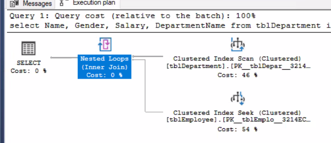
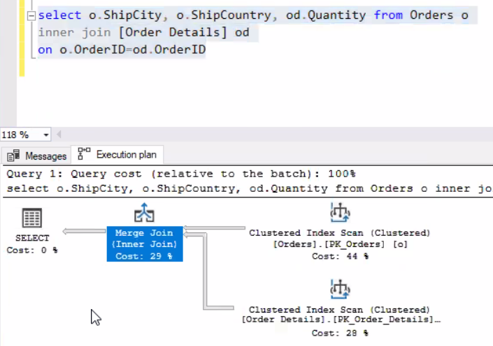

03/02/2021

# SQL Tuning

## Index

[doc](https://docs.microsoft.com/en-us/sql/relational-databases/sql-server-index-design-guide?view=sql-server-ver15)

### Definition

- Indexes are special data structures associated with tables or views that help speed up the query. 

  - A SQL Server index is an on-disk or in-memory structure associated with a table or view that speeds retrieval of rows from the table or view.

  -  An index contains keys built from one or more columns in the table or view.

    - For on-disk indexes

      Keys are stored in a tree structure **(B-tree)** that enables SQL Server to find the row or rows associated with the key values quickly and efficiently.

  - The  index is a **sorted list of keywords** , and for each keyword there are pointers to the data [pages](https://docs.microsoft.com/en-us/sql/relational-databases/pages-and-extents-architecture-guide?view=sql-server-ver15) where these keywords are located. 

- Pick  the right indexes for a database and its workload is a complex balancing act between query speed and update cost. 

### Types

- ##### Clustered

- ##### Nonclustered

select will be fast, insert/delete/update will be slow.

| clustered index                                              | non-clustered index                                          |
| ------------------------------------------------------------ | ------------------------------------------------------------ |
| data is **sorted** based on its key values                   | not sorted.                                                  |
| B-tree                                                       | B-tree                                                       |
| In the B-Tree, the root node and intermediate level nodes contain index pages that hold index rows. The leaf nodes contain the data pages of the underlying table. The pages in each level of the index are linked using another structure called a doubly-linked list. | defines a logical order that does not match the physical order on disk. sorts and stores data separately from the data rows in the table. <br>It is a copy of selected columns of data from a table with the links to the associated table. |
| 1 per table. if the table has `PK`, clustered index will be automatically created. | 1-N per table. `FK`s are always good candidate for non-clustered index because of joins |
| Faster to `read` than non clustered as data is physically stored in index order | Quicker for `insert` and `update` operations than a clustered index |

### Use Case

- To quickly find data that satisfy conditions in the `WHERE` clause.

- To find matching rows in the `JOIN` clause.

- To maintain `uniqueness` of key column during INSERT and UPDATE.
- To **Sort**, **Aggregate** and **Group** data.


### Examples

```sql
-- clustered index
create clustered index IX_tblEmployee_Salary 
on tblEmployee(ID DESC)

drop index tblEmployee.IX_tblEmployee_Salary

ALTER TABLE production.parts
ADD PRIMARY KEY(part_id);

-- nonclustered
CREATE INDEX ix_customers_city
ON sales.customers(city);
```


### Index Tuning

##### Try and compare the result in the **Actual Execution Plan**

- Narrow indexes (indexes with few columns in the index key), require less disk space and maintenance overhead. 
- Wide indexes, on the other hand, cover more queries. 

Experiment with several different designs before finding the most efficient index.


### Index Design

1. For what DB Type?

| OLTP                                                         | OLAP                                                         |
| ------------------------------------------------------------ | ------------------------------------------------------------ |
| frequent data modification, high throughput                  | process very large data set quickly                          |
| [Indexes for Memory-Optimized Tables](https://docs.microsoft.com/en-us/sql/relational-databases/in-memory-oltp/indexes-for-memory-optimized-tables?view=sql-server-ver15), or [Nonclustered Index for Memory-Optimized Tables Design Guidelines](https://docs.microsoft.com/en-us/sql/relational-databases/sql-server-index-design-guide?view=sql-server-ver15#inmem_nonclustered_index) and [Hash Index for Memory-Optimized Tables Design Guidelines](https://docs.microsoft.com/en-us/sql/relational-databases/sql-server-index-design-guide?view=sql-server-ver15#hash_index) | [Columnstore Indexes overview](https://docs.microsoft.com/en-us/sql/relational-databases/indexes/columnstore-indexes-overview?view=sql-server-ver15), or [Columnstore Index Design Guidelines](https://docs.microsoft.com/en-us/sql/relational-databases/sql-server-index-design-guide?view=sql-server-ver15#columnstore_index) |

2. Most frequently used queries

   where and join

3.  columns used in the queries

   - ideal for columns that have an **integer** data type and are also **unique** or **nonnull** columns.
   - For columns that have well-defined subsets of data, you can use a [filtered index](https://docs.microsoft.com/en-us/sql/relational-databases/sql-server-index-design-guide?view=sql-server-ver15#Filtered))

[read more](https://docs.microsoft.com/en-us/sql/relational-databases/sql-server-index-design-guide?view=sql-server-ver15) 


## Join operators

nested join/ merge join/ hash join

### For small table

##### Nested join



### For larger tables

| merge join             | hash join(avoid)           |
| ---------------------- | -------------------------- |
| join clustered indexes | join non-clustered indexes |
| data will be sorted    | unsort data                |





