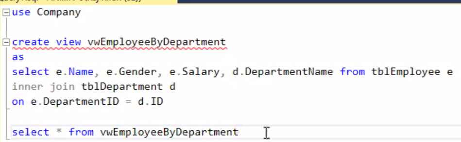

1) Get each employee name and department 

select first_name, last_name, d.name 

from employees e

join departments d

on e.department_id = d.id;

2) Department Name and number of employees belong to that department.

select d.name, count(e.id)

from departments

join employees e

on e.department_id = d.id

group by d.name;

--------------

### view 

view is for user

==only select==

security

- row level security

- column level security

can only perform select statement

create view viewName

as 

select ...

to insert/update/ delete data on multiple table in a view -> will get inconsistant data 

sp_helptext

sp_depends

drawbacks of view

##### Why to use triggers on views?

when we update table, and we have a View that joining multiple tables,

if we update, the view will be wrong.

 so resolve this, we need to use trigger  for updating operation 

create a insert trigger to view

when insert, sql automatically trigger the trigger

### Stored Procedures

use exec to run the stored producer

### Function

suppose we want to add two columns together and make a new column, we need to use function

### Trigger

two types of Triggers

- DML triggers     -- system admin
- DDL triggers     -- dev

Use trigger Qty = Qty - soldQty

##### Delete Trigger

##### Update Trigger

after / for

what is the difference between trigger and stored procedure?

what is the drawback of view

- to insert/update/ delete data on multiple table in a view -> will get inconsistent data 

  

------------------------------------------------------------------------------------------------------

query optimization

index

select will be fast, insert/delete/update will be slow.

| clustered index | non-clustered index |
| --------------- | ------------------- |
| sorted          | not sorted          |
| 1 per table     | 1-N per table       |

Join

nested join/ merge join/ hash join

nested join  - for small table

for larger tables

**merge join                               vs                hash join** (avoid)

join clustered indexes                             join non-clustered indexes

data will be sorted                                    no sort data

how to read the execution plan?

right to left

if join using non-clustered index, then it is hash join.

case when

