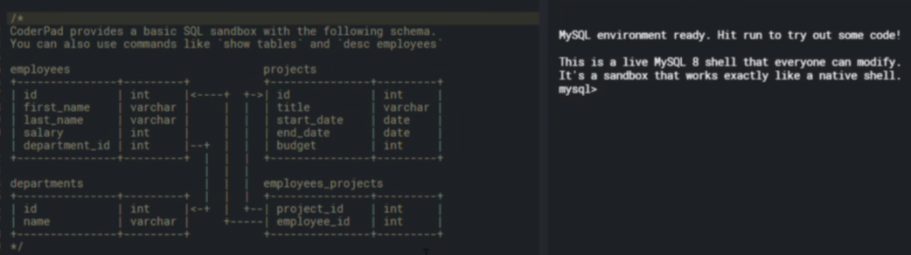

1) Get each employee name and department 

select first_name, last_name, d.name 

from employees e

join departments d

on e.department_id = d.id;

2) Department Name and number of employees belong to that department.

select d.name, count(e.id)

from departments

join employees e

on e.department_id = d.id

group by d.name;

