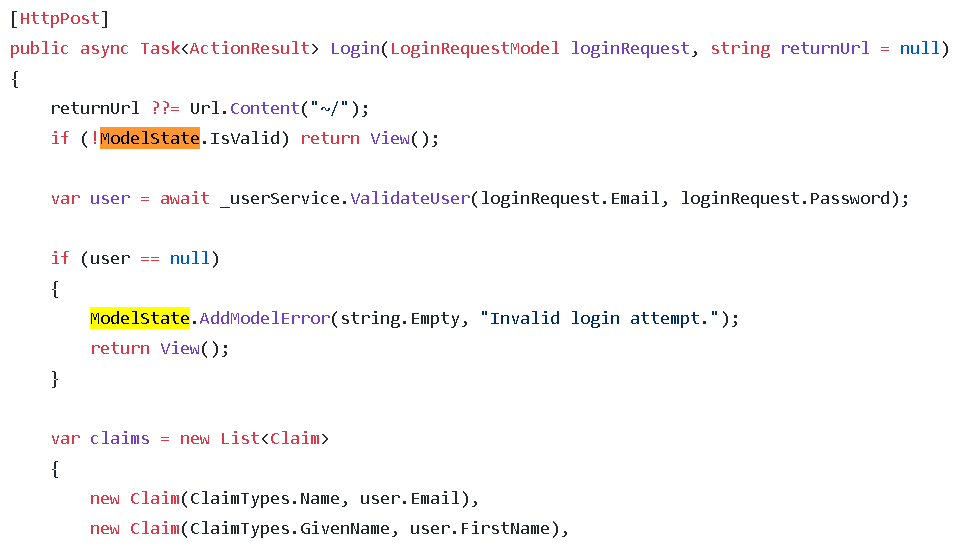
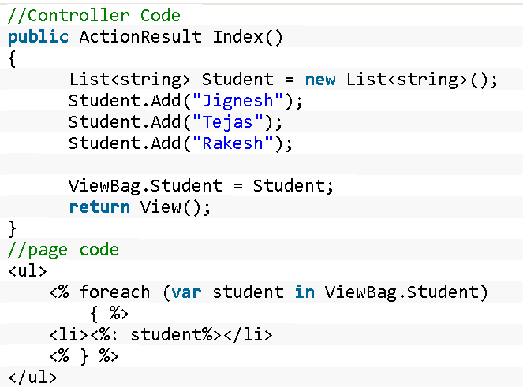
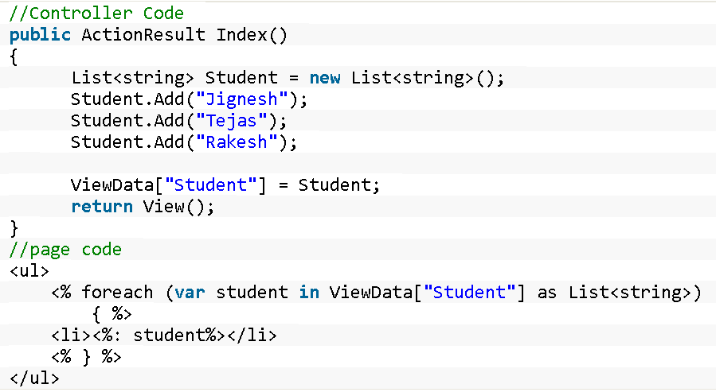
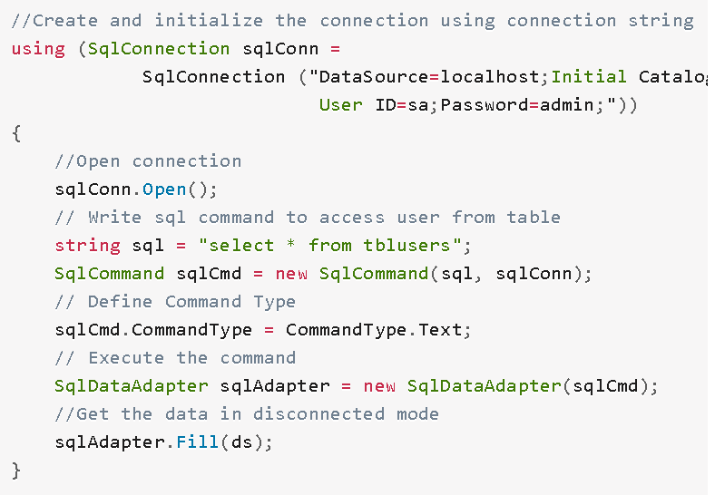
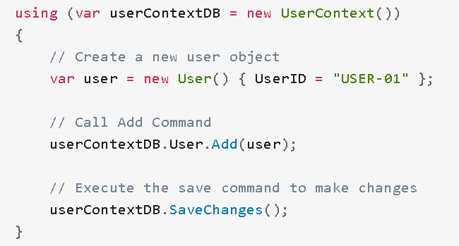
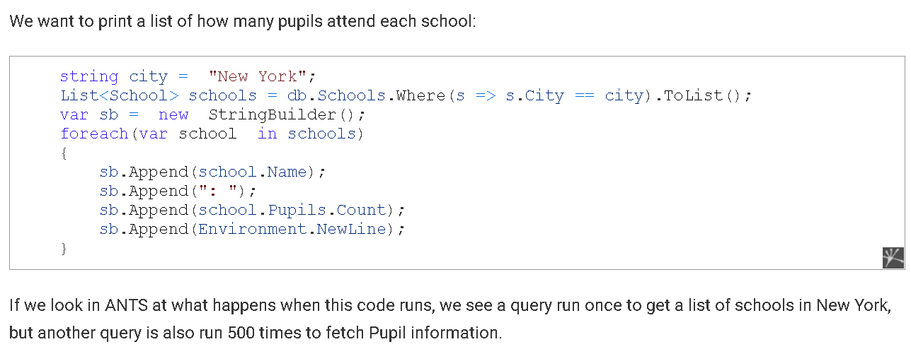
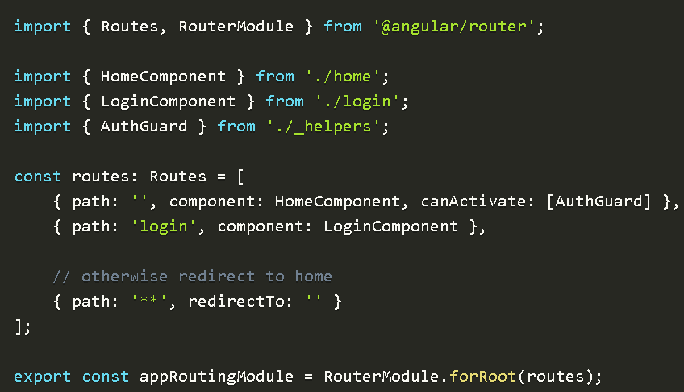
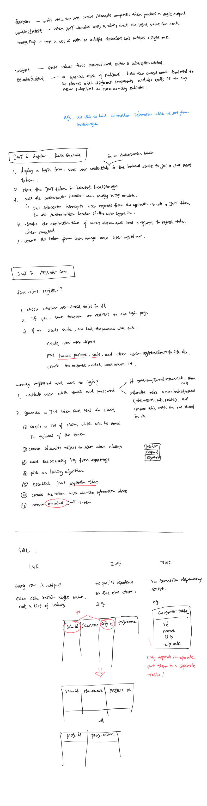

## C#

#### 1. abstract class vs interface

Give examples where you have used abstract classes and interfaces in your project

| Abstract Class                                               | Interface                                  |
| ------------------------------------------------------------ | ------------------------------------------ |
| cannot be instantiated                                       | -                                          |
| can have constructors and can be inherited with its derived class. | -                                          |
| abstract / non-abstract method, at least one abstract method is compulsory | default method / abstract method           |
| An Abstract Class should be used for a large project to share the common functionality with its derived class. |                                            |
| abstract class Animal{die();}                                | Services, factories, different strategies… |


#### 2. access modifiers

| public | private    | protected                                                 | internal                                                     |
| ------ | ---------- | --------------------------------------------------------- | ------------------------------------------------------------ |
|        | same class | same class and the classes that inherited from this class | accessible only within its assembly (executable files or dynamic link library) |

Internal is usually for commercial libraries developers

A common use of internal access is in component-based development because it enables a group of components to cooperate in a private manner without being exposed to the rest of the application code. 

For example, a framework for building UI could provide Control and Form classes that cooperate by using members with internal access. Since these members are internal, they are not exposed to code that is using the framework.


#### 3. String vs StringBuilder

String is immutable, StringBuilder is mutable. StringBuilder will not create a new modified instance of the current string object but do the modifications in the existing string object.


#### 4. static modifier

static members: method, 

| static members                                  | static class                                |
| ----------------------------------------------- | ------------------------------------------- |
| belongs to the class instead of class instances | can’t be instantiated. cannot be inherited. |

- non static method can **access** / **modify** static variables and static methods directly

**static block** or static initialization, to put some dummy db data to get test with. 


#### 5. Extension Methods

Explain, examples, how to build

##### Explain: 

- add methods to existing types

- they are static methods in a static class, but they get called as if they are instance methods. meaning we need to define extension methods in a class, then new an instance of the class to invoke this method.

##### Example of built-in extension methods: 

`Union`, `Where`, … from Linq library

##### Example of custom extension methods: 

custom method on string class, UpperCaseFirstLetter

```c#
class Program
{
    static void Main()
    {
        Console.WriteLine(UppercaseFirst("houston"));
        Console.WriteLine(UppercaseFirst("dallas"));
        Console.WriteLine(UppercaseFirst("austin"));
    }

    static string UppercaseFirst(string s)
    {
        // Check for empty string.
        if (string.IsNullOrEmpty(s))
        {
            return string.Empty;
        }
        char[] a = s.ToCharArray();
        a[0] = char.ToUpper(a[0]);
        return new string(a);
    }
}
```

#####  How to build custom extension methods:

- Create **static class** for extension methods

- Create a **static method** for the extension method

- Use **this** keyword for the class object value

```c#
public static class IntExtensions{
    public static bool IsGreaterThan(this int i, int value){
        return i>value;
    }
}

//Main
class Program{
    static void Main(String[] args){
        int i = 10;
        bool result = i.IsGreaterThan(100);
        cw(result);
    }
}
```


#### 6. Linq: what is it? Where you used LINQ?

Linq is a set of extension methods to interact with data sources.

I used linq to interact with in-memory data sources like List<> to filter data. Or Set<> database through EntityFramework and Dapper


#### 7. Generics. Scenarios where you used in the project

Generics help to separate logic and data type to increase reusability.

When design repository for data when interacting with the database. I created a generic repository that encapsulate all the basic CRUD operations which all tables share with each other

```c#
public interface IAsyncRepository<T> where T:class  
{
}
```


#### 8. collection classes

- [System.Collections.Generic](https://docs.microsoft.com/en-us/dotnet/api/system.collections.generic) classes
- [System.Collections.Concurrent](https://docs.microsoft.com/en-us/dotnet/api/system.collections.concurrent) classes (thread safe - multiple threads are accessing the collection concurrently)
- [System.Collections](https://docs.microsoft.com/en-us/dotnet/api/system.collections) classes

| Collection generic classes | collection classes |
| -------------------------- | ------------------ |
| Dictionary<TKey,TValue>    | ArrayList          |
| List\<T>                   | HashTable          |
| Queue\<T>                  | Queue              |
| Stack\<T>                  | Stack              |
| SortedList\<T>             |                    |


#### 9. delegates 

Reference data type that **holds the reference to a method.**

|               | input   | output  |
| ------------- | ------- | ------- |
| **Action**    | generic | void    |
| **Predicate** | generic | bool    |
| **Func**      | generic | generic |


#### 10. IEnumerable  VS IQueryable 

| IEnumerable                                                  | IQueryable                                                   |
| ------------------------------------------------------------ | ------------------------------------------------------------ |
| System.Collections namespace                                 | in System.Linq namespace                                     |
| no layzing loading -  query data into user-side in memory database before doing the filter | IQueryable execute and filter data at server-side            |
| functional objects (delegate)                                | IQueryable consists of a data source Provider and an Expression Tree |
|                                                              | **IQueryable** represents a logical query (lambda?) defined by an **Expression** Tree with a Provider that can convert and execute this logical query against a specific data source. [source](http://ikoshelev.azurewebsites.net/search/id/1/Expression-trees-and-advanced-queries-in-CSharp-01-IQueryable-and-Expression-Tree-basics#:~:text=From%20practical%20perspective%2C%20IQueryable%20represents,against%20a%20specific%20data%20source.) |


#### 11. async and await. 

methods still being executed in sequence, however, async method **don't get blocked, await in stead**. meanwhile, the program can execute other methods.

For example, our UI can still be responsive to user input and we don't freeze the webpage. We can have threads serve for other purposes.

Query data from the database


#### 12. Task vs Thread vs Process 

synchronous:

operations wait until a result is returned and in doing so occupy a thread (think of a thread as a small slice of a CPU’s time). Once a result is returned, that thread is then released (back to a thread pool) where it can be reused by some other operation.

The problem with synchronous operations is that if there is enough of them (think a high traffic API), eventually all the available threads will be used from the thread pool, blocking further operations from running.

*asynchronous* : 

not wait for a long-running operation

hand the thread back to the pool while it waits.

When the long-running operation does eventually have a result for us, a thread is reacquired by the controller action to complete the operation.

improve the situation where we may run out of threads (due to blocking) 

| Task                                                         | Thread                                                       | Process                                  |
| ------------------------------------------------------------ | ------------------------------------------------------------ | ---------------------------------------- |
| [Task](http://msdn.microsoft.com/en-us/library/system.threading.tasks.task.aspx) represents an asynchronous operation | Thread(s) are used to complete that operation by breaking the work up into chunks and assigning to separate threads. | multiple threads run in a single process |
| use this to prevent thread starvation.  hand the thread back to the pool while it waits. |                                                              |                                          |
| similar to threads, but allow the TPL(Task Parallel Library) system to decide, do I need a new thread to execute this Task? Or can I run it on the existing thread? In other words, not every `Task` needs a brand-new `Thread`. | A `Thread` is a way of fulfilling that promise. But not every `Task` needs a brand-new `Thread`. (In fact, creating a thread is often undesirable, because doing so is much more expensive than re-using an existing thread from the thread pool. |                                          |
| represents some asynchronous operation and is part of the [Task Parallel Library](http://msdn.microsoft.com/en-us/library/dd460717(v=vs.110).aspx), | multiple threads run in a single process, sharing the same execution environment (memory, in particular). This, in part, is why multithreading is useful: one thread can fetch data in the background, for instance, while another thread displays the data as it arrives. This data is referred to as shared state. |                                          |


#### 13. WhenAll vs WhenAny 

| WhenAll                                                      | WhenAny                                                      |
| ------------------------------------------------------------ | ------------------------------------------------------------ |
| will wait for all operations are done – the longest task to be done | will wait for the first operation is done – the shortest task to be done |


####  14. purpose of ConfigureAwait()

ConfigureAwait tells which thread the ==continuation task== should run on.

when write to UI, set ConfigureAwait to **`true`** to make sure the continuation thread return to the UI thread.

- if set to false, exception
- UI controls are not allowed to be modified by any other thread than the UI thread. So if a background worker tries to change something it will throw an exception. This is because the UI is a single resource, if multiple threads were writing to it in parallel it would be a mess.

when write to library code that will be shared and used by other people, set to **`false`**.

- **ConfigureAwait**(false) configures the task so that continuation after the await does not have to be run in the caller context, therefore avoiding any possible deadlocks
- avoids that the callback is executed in the original *SynchronizationContext* 


related terms:

SynchronizationContext: Every running thread has its “current” *SynchronizationContext*

continuation task: it is an async **task** that's invoked by another **task**


#### 15. Asynchronous Programming vs Multithreaded Programming

| asynchronous programming                                     | multithreaded programming                                    |
| ------------------------------------------------------------ | ------------------------------------------------------------ |
| use tasks                                                    | use threads                                                  |
| non-blocking **execution between functions**                 | concurrent execution of different functions                  |
| a **Task** is a future or a promise. "promises" to return you a `T`, but not right now honey, I'm kinda busy, why don't you come back later? | A **Thread** is a way of fulfilling that promise. Threads can themselves split into two or more simultaneously running **tasks** . |

- **Asynchronous, single threaded**: you start the eggs cooking and set a timer. You start the toast cooking, and set a timer. While they are both cooking, you clean the kitchen. When the timers go off you take the eggs off the heat and the toast out of the toaster and serve them.

- **Asynchronous, multithreaded**: you hire two more cooks, one to cook eggs and one to cook toast. Now you have the problem of **coordinating the cook**s so that they do not conflict with each other in the kitchen when sharing resources. And you have to pay them.

  

## ASP.NET Core

#### 1. What is model binding?

**map the incoming request to c# object, case insensitive** 

Controllers and Razor pages work with data that comes from HTTP requests. We need to retrieve data from requests and convert them from string to .NET types.

1. Retrieve data from sources like:

- route data
  - id
- form fields
- query strings

2. provide the data to controllers and razor pages
3. Converts string data to .NET types.
4. Updates properties of complex types.


#### 2. Diffs between .Net Core and .Net Framework? newly introduced functionalities in ASP.NET Core? 

| .Net Core                     | .Net Framework           |
| ----------------------------- | ------------------------ |
| cross-platform and opensource | exclusive for windows OS |

.Net core: 

- Docker container (multiple environment)

- microservices,

- CLI

- Extensive use of async/await

- Unified MVC & API

- Swagger

- Action filter (Function decorations)

  

#### 3. Middleware vs HttpModule?  built-in middlewares? 

| HttpHandler                                                  | HttpModule                                                   | Middleware                                                   |
| ------------------------------------------------------------ | ------------------------------------------------------------ | ------------------------------------------------------------ |
| old                                                          | old                                                          | new                                                          |
| **extension based.** handle requests for file name with specific extension, such as .rss | **event** based. It is called on every request that is made to your application. | = `HttpHandler` +`HttpModules`                               |
|                                                              | Event in http request pipeline                               | Independent from application events. <br>small application components that can be incorporated into an HTTP request pipeline. |
|                                                              | no control over the orders                                   | Full control of orders                                       |
|                                                              | attached to application events                               |                                                              |
| configure in web.config.                                     | configured via web.config or Global.asax.                    |                                                              |

built-in middleware(s) 

| Middleware     |                                                           |
| -------------- | --------------------------------------------------------- |
| Authentication | Provides authentication support.                          |
| CORS           | Configures Cross-Origin Resource Sharing.                 |
| Routing        | Define and constrain request routes.                      |
| Session        | Provides support for managing user sessions.              |
| Diagnostics    | Includes support for error pages and runtime information. |


#### 4. DI scopes

| AddTransient                                                 | AddScoped                                                    | AddSingleton                         |
| ------------------------------------------------------------ | ------------------------------------------------------------ | ------------------------------------ |
| create one instance for each injection                       | Use same instance for each request, different for each request | use same instance for all injections |
| a new instance is provided to every controller and every service. |                                                              |                                      |


#### 5. What is “Developer Exception Page” used in .Net Core? How can we configure custom exception handling page in ASP.Net Core?

- Display the stack trace of the error and other important info to help you debug the issue.
- order matters!  adding the Developer Exception Page middleware before you are going into MVC.
- Configure:
  - Middleware in startup.cs file: 
    - Development: UseDeveloperExceptionPage, 
    - Production: UseExceptionhandler(“Error”) (MVC only)

custom exception handling: 

use middleware to catch all exceptions and redirect the user to a particular error page.


#### 6. the use of a filter and filter types 

filters allow code to be run **before or after** executing the action method.

filter types:

- ***Authorization filters***   --1st executed

- ***Resource filters***  --2

- ***Action filters***

  Run code immediately before and after an action method is called

- ***Exception filters***

  apply global policies to unhandled exceptions 

- ***Result filters***

  before and after action results. Only runs if the action is completed

  

ASP.NET MVC creates objects using the model binding process with the data which is sent by the browser in an HTTP request. The action method parameters are created through model binding from the data in the request.


#### 7. Caching 

a cache makes it easy to quickly retrieve data so it helps the devices run faster; for example, we can cache data that is less changed but frequently accessed in memory, compare to the round network trip to get data from a physical disk.

**Examples of caching:** 

- product catalog, menu

  English time: catalog vs category

  

- use session data like cookies

- Data that is expensive or takes long to calculate can be put in cache. Some columns for 10-year report for example

Redis is a popular key-value pair database that used in distributed caching.


#### 8. validate models? Any experience with FluentValidation library? 

 In MVC we need to inspect `ModelState.IsValid` and react appropriately. 



​													ModelState 

​					/																	\

| model biding                       | model validation                                             |
| ---------------------------------- | ------------------------------------------------------------ |
| checks the data conversion errors  | data doesn't conform to business rules                       |
| "x" is entered in an integer field | 0 is entered in a field that expects a rating between 1 and 5 |

Web API controllers don't have to check `ModelState.IsValid` if they have the `[ApiController]` attribute. In that case, an automatic HTTP 400 response containing error details is returned when model state is invalid. For more information, see [Automatic HTTP 400 responses](https://docs.microsoft.com/en-us/aspnet/core/web-api/?view=aspnetcore-5.0#automatic-http-400-responses).


[Built-in Validation attributes](https://docs.microsoft.com/en-us/aspnet/core/mvc/models/validation?view=aspnetcore-5.0#built-in-attributes): [CreditCard], [EmailAddress], [Required],..


**`Fluent Validation`**. It's a small validation library for .NET that uses a fluent interface and lambda expressions for building validation rules for your business objects

FluentValidation:

- Services.AddMvc(…).AddFluentValidation();

How it works:

```c#
public class Person {
	public int Id { get; set; }
	public string Name { get; set; }
	public string Email { get; set; }
	public int Age { get; set; }
}

public class PersonValidator : AbstractValidator<Person> {
	public PersonValidator() {
		RuleFor(x => x.Id).NotNull();
		RuleFor(x => x.Name).Length(0, 10);
		RuleFor(x => x.Email).EmailAddress();
		RuleFor(x => x.Age).InclusiveBetween(18, 60);
	}
}
```


## Web API/ REST

#### 1. SOAP vs REST

2 different approaches to online data transmission.

| SOAP                                                         | REST                                                         |
| ------------------------------------------------------------ | ------------------------------------------------------------ |
| protocol                                                     | Architectural style                                          |
| simple object access protocol                                | representational state transfer                              |
| only XML                                                     | REST work with plain text, XML, HTML and JSON.               |
| Because it is a protocol, it imposes built-in rules that increase its complexity and overhead, which can lead to longer page load times. | most web services using REST rely exclusively on using the URL approach. REST can use different verbs such as GET, POST, PUT, and DELETE to perform tasks. |
| needs more bandwidth for its usage                           | doesn’t need much bandwidth.                                 |


#### 2.diffs between POST,PUT,PATCH

| POST                                                         | PUT                                                          | PATCH                        |
| ------------------------------------------------------------ | ------------------------------------------------------------ | ---------------------------- |
| always for creating a resource ( does not matter if it was duplicated ) | checking if resource is exists then update , else create new resource. | always for update a resource |

[patch](https://medium.com/easyread/http-patch-method-ive-thought-the-wrong-way-c62ad281cb8) , [more patch](https://developer.mozilla.org/en-US/docs/Web/HTTP/Methods/PATCH)

#### 3.JWT in Web API

jwt is the approach to secure the web API.

JWT consists three parts:

1. Header(algo, token type)
2. Payload (claims, data)
3. Signature = encoded(header) + encoded(payload)+signature

We store JWT token on the client side, typically in the local storage. Remember to not to put any sensitive data in there. 

Pay extra attention to `localStorage.getItem`

Alternatively, we can store JWT inside an `HttpOnly cookie`, it is a special kind of cookie that only sent in HTTP requests to the server, and its never accessible(both read and write) from JavaScript running in the browser, so attacks like XSS cannot be used to steal all the data.

[ref](https://stackoverflow.com/questions/40281050/jwt-authentication-for-asp-net-web-api)


#### 4.How would you handle exceptions in Web API? which framework to log these exceptions?

exception filter, exception middleware

I use built-in  ILogger interface and serilog.

[ref](https://code-maze.com/global-error-handling-aspnetcore/)


#### 5.How did you validate your API? Any third-party validation libraries like `FluetnValidation`?

- Data Annotation validation to do property level validation

- IValidateableObject interface to do class level validation

- Fluent Validation, a very popular tool support all kinds of custom validation rules. 

  ```c#
  RuleFor(x => x.Id).GreaterThan(0).WithMessage("The Product ID must be at greather than 0.");  
    
  RuleFor(x => x.Name)  
      .NotEmpty()  
      .WithMessage("The Product Name cannot be blank.")  
      .Length(0, 100)  
      .WithMessage("The Product Name cannot be more than 100 characters.");  
  
  RuleFor(x => x.Description)  
      .NotEmpty()  
      .WithMessage("The Product Description must be at least 150 characters long.");  
  
  RuleFor(x => x.Price).GreaterThan(0).WithMessage("The Product Price must be at greather than 0."); 
  ```

  

#### 6.What is CORS and how can you apply that to your API?

Cross-Origin Resource Sharing. Browser implements the same origin policy as a part of the security model. Use CORS allows data to be shared from different origins.

steps to apply:

1. put url that we want to share in appsettings

2.  in startup file, config CORS and read value from appsettings

    

#### 7.How to do unit testing in Web API? What tools you use to test Web API?

+`Microsoft.AspNetCore.Mvc.Testing` package

XUnit (built-in)

Moq -library to help to create mock objects

AAA: Arrange, Act and Assert; 

- Arrange: Initialize objects, create mocks with arguments that are passed to the method under test and adds expectations
- Act: Invokes the method or property under test with the arranged parameters
- Assert: Verifies the action of the method under test behaves as expected


## ASP.NET MVC5

#### 1.MVC'S life cycle


https://www.c-sharpcorner.com/article/asp-net-core-mvc-request-life-cycle/


#### 2.routing in MVC, attribute routing

*Routing* is how ASP.NET MVC matches a URI to an action. In the earlier days, we have convention-based routing and it is still in use.

In previous version of ASP.NET MVC, the rules would be set in the `RouteConfig.cs` file, and point to the actual controller actions,

```c#
// old days need to write in RouteConfig file
routes.MapRoute(
    name: “ProductPage”,
    url: “{productId}/{productTitle}”,
    defaults: new { controller = “Products”, action = “Show” },
    constraints: new { productId = “\\d+” }
);

```

```c#
// attribute routing
[Route(“{productId:int}/{productTitle}”)]
public ActionResult Show(int productId) { … }
```


#### 3.Various action results in MVC


#### 4. How do you pass data from Controller to View and from View to Controller?

\-    View Models:

- strongly typed

\-    View Bags: 

- `@ViewBag.Name`

- dynamic property 

- similar to View Data

- don’t have compile-time checking, resolve at runtime

  

\-    View Data:

- `@ViewData["Name"]`

- dictionary, key-value pair
- string keys
- don’t have compile-time checking, resolve at runtime

  

 ***TempData*** is a bucket where you can dump *data* that is only needed for the following request. **TempData** stays for a subsequent HTTP Request as opposed to other options ( ViewBag and ViewData ) those stay only for current request. So, TempdData can be used to maintain **data** between controller actions as well as redirects.


#### 5.Different state management techniques in ASP.net (Server-side: Sessions, Caching, Database, TempData & Client-side: localStorage, cookies, sessionStorage etc


## Entity Framework/ORM/Dapper 

#### 1.   What is an ORM? What are the advantages of Entity Framework over ADO.net? 

ORM -  convert data between OOP language and database

| Entity Framework                                             | ADO.NET                                                      |
| ------------------------------------------------------------ | ------------------------------------------------------------ |
| it creates the necessary code automatically for storing, and retrieving data, hence, developer only need to focus on creating the application, not dealing with databases and its problems. | create everything from scratch and have a full access control of a database in the application. |
| built on top of an ADO.NET                                   |                                                              |

advantage of EF over ADO.net:

1. less code
2. framework handles many operations for us under the hood, so developers can focus on the production and business logic.






#### 2. Disadvantages of EF

ADO.NET provides better **performance** as it is directly connected to the data source, which makes the processing faster than Entity Framework as it translates LINQ queries to SQL first then process the query.

**how would you improve the performances of EF?**

1. don't use toList() at front, we don't want to get every row from that table. let sql server do the filtering, and transfer us less data.
2. 
3. disable change tracking for entity if not needed. if we are just reading and retrieving the data, we are not modifying the database, hence no need to do object tracking every single time.
4. avoid fetching all the fields if not required
5. use LINQ Pad to debug and optimize LINQ queries
6. use a performance profiler

https://exceptionnotfound.net/dapper-vs-entity-framework-vs-ado-net-performance-benchmarking/

https://www.red-gate.com/simple-talk/dotnet/net-tools/entity-framework-performance-and-what-you-can-do-about-it/


#### 3.Steps of code first approach with migrations.

- In appsettings, setup connection string
- create entities
- attach entities into dbContext
- use console to add migration 


#### 4.**What is the difference between lazy loading and eager loading? What is N + 1 problem.** 

- lazy loading (default)

  - EF loads only the data for the primary object in the LINQ query and leaves other related objects
  - for example, in my project, each roomTpe has a list of rooms. we would not retrieve them unless I specifically include them.  
  -  Most of the time that’s a good idea because otherwise any time you accessed a roomTpe object, EF would bring back all related rooms data regardless of whether it were needed. 

- eager loading 

  use if we also need the associated data
  
  ```c#
  List<School> schools = db.Schools     
      .Where(s => s.City == city)
  	    .Include(x => x.Pupils)
  	     .ToList();
  ```
  
  

**N+1 problem** = lazy loading. we only retrieve just the amount of data, which we need in a single query. When we need more data related to the initial data, additional queries are issued to the database.



If you are not sure of what data is exactly needed, start with Lazy Loading and if it is leading to N + 1 problem then Eager Loading handles the data better. 


#### 5.How would you see the SQL queries generated by Entity Framework? What tools or coding would you implement ?

`ToTraceString` of ObjectQuery

We can add it into your watch window and set a breakpoint to see what the query would be at any given point for any LINQ query.

```c#
IQueryable query = from x in appEntities
             where x.id == 32
             select x;

var sql = ((System.Data.Objects.ObjectQuery)query).ToTraceString();
```

SQL Server Profiler


## Angular 

#### 1.What is two-way binding? How to create one?

two-way binding = property binding + event binding

exchange data from the component to view and from view to the component. combine property and event binding. bind both directions.

use `[(ngModel)]`

```html
<input type="text" [(ngModel)] = 'val' />
```


#### 2.What is a parent component and a child component, why do you use them? How you pass data from a parent component to a child component and vice versa and between unrelated Components?

parent component, for example itemlist

child component, for example item

pass data from parent to child use `@input` on the child component

pass data from child to parent use `@output` on the child component

**Sharing data between not related components:**

use ` service` and dependency injection to share data between components that are not directly related. 


#### 3.What are directives, give me examples of built-in directives and custom directives you created

Directives are **classes** that add more extra functionality to elements in the DOM.

there are 3 types of directives: 

- components

  - **Components** are the main building block for **Angular** applications.
  - Each **component** consists of: 
    - css
    - html template
    - ts defines behavior

- attribute directives

  - change the **look or behavior** of an HTML element

  - e.g., `ngClass`, `ngStyle`, `ngModel`

  - ```typescript
    <p [ngStyle]="{'background': isBlue ? 'blue' : 'red'}"> I am an Attribute Directive</p>
    ```

- structural directives

  - manipulate the DOM layout. add or remove elements 

  - e.g., `ngFor`, `ngIf`, `ngSwitch`

  - ```typescript
    <p *ngIf="show">I am a Structural Directive</p>
    ```

- custom directive

  - just like creating an Angular component. But to replace `@Component` decorator with `@Directive` decorator.

  - `ng generate directive highlight`

    ```c#
    //app-highlight.directive.ts
    import { Directive, ElementRef } from '@angular/core';
    
    @Directive({
                selector: '[appHighlight]'
    })  
    
    export class HighlightDirective {
            constructor(private eleRef: ElementRef) { // use ElementRef to access DOM element
                      eleRef.nativeElement.style.background = 'red';
            }
    }
    
    // xx.html
    <p app:Highlight>This is invalid</p>
    ```

    

[real life usecases for custom directives](https://www.reddit.com/r/Angular2/comments/6zempd/what_are_real_life_usecases_for_custom_directives/)

`ElementRef` is a wrapper for our actual DOM element and we access the DOM element using the property `nativeElement` on it.


#### 4.Explain Angular Interceptors and their use case

##### What is interceptors?

similar to middleware in ASP.NET Core

- handling HTTP requests at a global application level.
- allow us to intercept incoming or outgoing HTTP requests using the `HttpClient`. By intercepting the HTTP request, we can modify or change the value of the request.

**Interceptors** can be really useful for features like authentication, caching and logging.


https://ultimatecourses.com/blog/intro-to-angular-http-interceptors

[**How to build an use interceptor?**](https://www.thirdrocktechkno.com/blog/how-to-integrate-interceptor-in-angular-9/)


#### 5.What is an Angular Service? What are the features of Angular Service?

An Angular service is a singleton that can be wired with components or other services via **Dependency Injection.**

when we get into the situation where we need to use the same code again and again, use a service to wrap the reusable code.

Examples of using service can be `LogService` to centralize our log statement, `APIService` to write common functionalities to get the data from api endpoints

#####  logging service example:


#### 6.How do you make Ajax calls in Angular (HttpClient in angular)?

Ajax is a way to exchange or pull data from a server.

HttpClient  is a libray we need to use

steps:

1. create a service file and inject the HttpClient in constructor
2. send AJAX request(CRUD) to the server

example

```typescript
// api.service.ts

@Injectable()
export class ApiService {

  constructor(protected http:HttpClient) { }

  getAll(path: string): Observable<any[]> {
    return this.http.get(`${environment.apiUrl}${path}`)
      .pipe(
        map(resp => resp as any[])
      );
  }
}
```


#### 7.What are Observables? Where did you use them, explain forkJoin, combinelatest, mergemap operators in relation with Http and Angular?

Observables can be think as various data sources: (User Input) Events, Http Requests, Triggered in Code, ...

And Observer is a subscribe function and we need to implement that in our code to handle the data.


`forkJoin`: waits until the last input observable completes, and then produces a single value and completes.

`combineLatest`: When **ANY** observable emits a value, emit the latest value from each.

`mergeMap`: map a set of data to multiple observable objects and output as a single one

- `mergeMap`will subscribe to every inner observable immediately
- be careful of memory leaks. `mergeMap` will retain subscriptions to long lived subscriptions such as a stream of DOM events(*click*) so be sure to clean up after yourself!

- mergemap example:  simulating save of click locations

[The RxJs mergeMap Operator](https://blog.angular-university.io/rxjs-higher-order-mapping/#therxjsmergemapoperator:~:text=The RxJs mergeMap Operator,-If)


#### 8.what is Subject, BehaviorSubject ? 

The RxJS **`BehaviorSubject`** is a special type of Subject that keeps hold of the current value and emits it to any new subscribers as soon as they subscribe, while regular Subjects don't store the current value and only emit values that are published after a subscription is created.

The **BehaviorSubject** holds the value that needs to be shared with other components.

Example with **BehaviorSubject**:

```ts
// Behavior Subject

// a is an initial value. if there is a subscription 
// after this, it would get "a" value immediately
let bSubject = new BehaviorSubject("a"); 

bSubject.next("b");

bSubject.subscribe(value => {
  console.log("Subscription got", value); // Subscription got b, 
                                          // ^ This would not happen 
                                          // for a generic observable 
                                          // or generic subject by default
});

bSubject.next("c"); // Subscription got c
bSubject.next("d"); // Subscription got d
```


#### 9.Authentication process in your Angular application that includes JWT, Route Guards etc.

[Session vs JWT Authentication in Angular](https://developer.okta.com/blog/2019/05/16/angular-authentication-jwt#session-vs-jwt-authentication-in-angular)

##### JWT steps

1. Displays a login form, and sends user credentials to the back-end service to get a JWT access token, and a refresh token.

2. Stores the JWT access token and refresh token in a browser’s localStorage, so that the application in different browser tabs can use the same tokens.

3. Adds an authorization header when sending HTTP requests.

   `JWT Interceptor` intercepts http requests from the application to add a JWT auth token to the Authorization header if the user is logged in.

4. Tracks the expiration time of the access token and sends a request to refresh tokens when the access token is about to expire.

5. Removes the tokens from localStorage when the user logs out.

[ref](https://codeburst.io/jwt-authentication-in-angular-48cfa882832c)


##### Route Guards

route guard that's used to prevent unauthenticated users from accessing restricted routes

implement `CanActivate ` interface and override `canActivate` 

```typescript
// src/app/auth/auth-guard.service.ts
import { Injectable } from '@angular/core';
import { Router, CanActivate } from '@angular/router';
import { AuthService } from './auth.service';
@Injectable()
export class AuthGuardService implements CanActivate {
  constructor(public auth: AuthService, public router: Router) {}
  canActivate(): boolean {
    if (!this.auth.isAuthenticated()) {
      this.router.navigate(['login']);
      return false;
    }
    return true;
  }
}
```




[https://jasonwatmore.com/post/2019/06/22/angular-8-jwt-authentication-example-tutorial](https://jasonwatmore.com/post/2019/06/22/angular-8-jwt-authentication-example-tutorial)


## SQL 

**1.**   **Can you explain about Normalization, especially 3NF and how it is helpful? Tell me scenarios where De-Normalization is useful?** 

- 1NF:

  o  each table cell should contain a single value

  o  each record needs to be unique

- 2NF:

  o  Single column primary key

  o  No partial dependencies, columns need to be fully functional dependent on the primary key.

- 3NF

   no transition dependency exists.

  

  change to 

  another example

scenarios where De-Normalization is useful:

- Maintaining history: Data can change during time, and we need to store values that were valid when a record was created. ...

- Improving query performance: Some of **the** queries may use multiple tables to access data that we frequently need.

  

##### 2. What are the indexes and what are the advantages and advantages (explain both clustered and non-clustered)?

1. **Clustered Index**

   defines the order of the data stored in a table physically . Table data can be sorted in only way, therefore, there can be only one clustered index per table.

   - pro
     - fast search
       - don't need to do additional lookups to go find different data elsewhere
   - con
     - insert and update might be slow, because our clustered index table store data in a certain order
       - if we insert data not the newest and not the oldest, if it is something in the middle and if there's not enough free space available, it is gonna start shifting data around so the new inserted row fits. the extra processing could take some time

   Usually we can put clustered index on the pk. But sometimes it can be much more beneficial to put your clustered index on something that isn’t your PK, like a different column that is getting more use than our PK.

   For example, we often only interested in the latest data, so we might use the dataetime column very often in the query, hence use that column to be the clustered index key would makes more sense.

2. **Non-Clustered Index**

   a separate file that lists things in a sorted order based on whatever columns you're indexing, then gives you a pointer to where the actual data is stored in sql server.

   This allows for more than one non-clustered index per table.

   - pro
     - improve performance
   - con
     - overhead, take additional spaces, additional lookups and duplicate data

[ref](https://hackernoon.com/clustered-vs-nonclustered-what-index-is-right-for-my-data-717b329d042c)


##### 3. what are the benefits of CTE?

\-    Reduce complexity in a query

\-    Readability

\-    Recursion


##### 4.Explain all the joins


##### 5. How would you perform pagination with Stored Procedures (SQL Statements)? 

Use OFFSET & FETCH NEXT operators to implement paging

[ref](https://www.c-sharpcorner.com/blogs/efficient-paging-using-stored-procedure-in-sql-server)


##### 6. Explain all the steps for Performance Tuning of a query?


- No Select *
- check the row count, avoid unnecessary data
- use join instead of sub-queries
- check the execution plan and see which part takes longer time than expected
- [more](https://stackify.com/performance-tuning-in-sql-server-find-slow-queries/)


## Web/HTML

**1.**   **What is a CDN and what is the benefit of using one?** 

Content Delivery Network: Server to provider content for HTML

\-    Improve load time

\-    Reduce bandwidth

\-    Improve security

content providers can deliver fast, quality web experiences to all their end users; no matter what location, browser, device, or network they’re connecting from. 


**2.**   **What does a doctype do ?** 

\-    Information for browsers to know what document type to expect

**3.**   **Semantics in HTML ?** 

\-    Non-semantic elements: div, span

\-    Semantic element describes its meaning: form, table, article, session, p ,…


## CSS 

**1.**   **What is the CSS display property, and can you give a few examples of its use?** 

Specify the display behaviors of an element: none, inline, block, inline-block


**2.**   **Explain CSS Box Model ?** 

CSS box model is a box that wraps around every HTML element. It consists of: 

- margins, 
  - an area outside the border. The margin is transparent
- borders, 
  - A border that goes around the padding and content
- padding, 
  - an area around the content. The padding is transparent
- the actual content
  -  text and images 


## **JavaScript** 

**1.**   **What is the diff between == and === ?** 

== compare the value

=== compare the value and its type


**2.**   **Explain Promises in JS along with its use case?** 

A promise is an object that may produce a single value some time in the future. we can avoid callback hell and working with promises is much easier for us to control asynchronous data flows. 

promise states: 

1. fulfilled, 
2. rejected, 
3. pending. 

Promises are eager, meaning that a promise will start doing whatever task you give it as soon as the promise constructor is invoked. If you need lazy, check out [observables](https://github.com/Reactive-Extensions/RxJS) or [tasks](https://github.com/rpominov/fun-task).

use case:

A function marked with `async` always returns a Promise.

```
Promise.resolve('./file1.txt')
	.then(resolve)
	.then(readFile)
	.then(data => console.log(data))
	.catch(error => console.error(error));
```

I prefer to use async/await which was built on top of promises.


**3.**   **Tell me how to make an AJAX call using jQuery.** 

Using jQuery only for AJAX request inside an angular application is a bad practice. Because you are loading the entire jQuery library only to use it for AJAX. 


**4.**   **Explain the same-origin policy with regards to JavaScript, CORS?** 

The **same-origin policy** is a security mechanism that restricts the script to be loaded if it comes from a different origin.


CORS: 

Use [CORS](https://developer.mozilla.org/en-US/docs/Web/HTTP/CORS) to allow cross-origin access.

CORS is a part of [HTTP](https://developer.mozilla.org/en-US/docs/Glossary/HTTP) that lets servers specify which host and method should permit loading the content.


**5.**   **What tools and techniques do you use debugging JavaScript code?**

chrome developer tools


## **Architecture and Design** 

**1. What is dependency injection. Advantages and Disadvantages. Your use of dependency in your project. What IOC did you use in your project?** 


**2. Explain SOLID principles.** 

- single responsibility 

  no more than one reason for a [class](https://en.wikipedia.org/wiki/Class_(computer_programming)) to change

- open/close

  open for extension, close for modification

- liskov substitution

  functions that are used in the base class must be able to use objects of the derived class without knowing it.

- interface segregation

  Many client-specific interfaces are better than one general-purpose interface

- dependency inversion

  Depend upon abstractions, [not] concretions


**3. Explain the design patterns you have used in your project a) Dependency Injection** 


补充:

